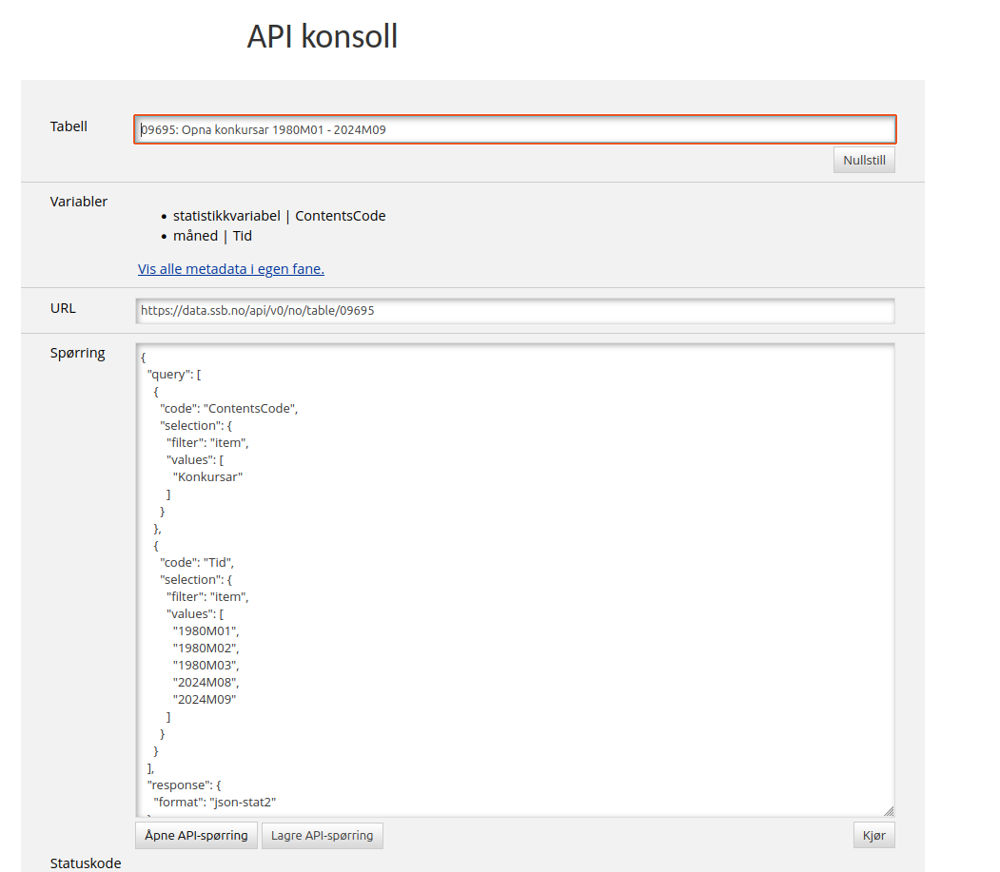
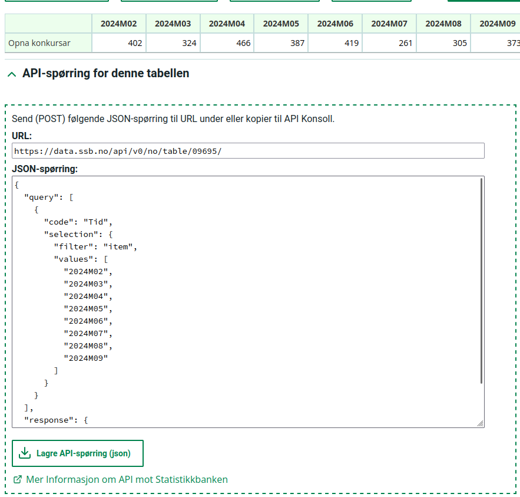

---
jupytext:
  text_representation:
    extension: .md
    format_name: myst
    format_version: 0.13
    jupytext_version: 1.17.0
kernelspec:
  display_name: Python 3 (ipykernel)
  language: python
  name: python3
---

```{code-cell} ipython3
import pandas as pd
import requests
import json
from pyjstat import pyjstat
```

## Først et lite sports-api

* [https://api-sports.io/](https://api-sports.io/)
* Lag gratis konto eller logg in med google

```{code-cell} ipython3
api_key = "31d5cf4a12d29e845d6b08db3ede0685" #Din api-nøkkel

headers = {"x-apisports-key": api_key}

base_url = "https://v3.football.api-sports.io/"
liga = "league"
response = requests.get(f"{base_url}/leagues", headers=headers)
response.json()
```

```{code-cell} ipython3
with open("ligaer.json", "w") as file:
    json.dump(response.json(), file)

alle_ligaer = response.json()

norske_ligaer = []
for liga in alle_ligaer["response"]:
    if liga["country"]["name"] == "Norway":
        norske_ligaer.append(liga)


for liga in norske_ligaer:
    #print(liga["league"]["name"])
    if liga["league"]["name"] == "Eliteserien":
        liga_id = liga["league"]["id"]
```

```{code-cell} ipython3
parameters = {"season": 2022, "league": liga_id} 
response = requests.get(f"{base_url}/teams", params=parameters, headers=headers)
response.status_code
```

```{code-cell} ipython3
lag_data = response.json()

for lag in lag_data["response"]:
    if lag["team"]["name"] == "Aalesund":
        lag_id = lag["team"]["id"]

```

```{code-cell} ipython3
parameters = {"team": lag_id, "league": liga_id, "season": 2022}
response = requests.get(f"{base_url}/teams/statistics", params=parameters, headers=headers)
response.status_code
```

```{code-cell} ipython3
aafk_data = response.json()
resultat = aafk_data["response"]["fixtures"]
df = pd.DataFrame(data=resultat)
df.plot.bar()
```

# SSB sitt webAPI

+++

* SSB har et eget webAPI slik at du automatisk kan hente inn nyeste data til:
  * Analyse
  * Visualisering
* Man kan få data på flere formater, vi anbefaler `json_stat`
  * Bruk `pyjstat` til å lese data inn i dataframe slik som fra eurostat

+++

* Dersom man prøver å hente inn data fra feks tabell 09695 med et GET request får man tilbake meta-data om tabellen:
* [https://data.ssb.no/api/v0/no/table/09695](https://data.ssb.no/api/v0/no/table/09695)

```{code-cell} ipython3
konkurser_url ="https://data.ssb.no/api/v0/no/table/09695"
response = requests.get(konkurser_url)
metadata = response.json()
metadata
```

* Det kan være nyttig å hente ut metadata og undersøke den
* Vi kan laste det inn i python og gjøre filtrering på hva vi vil ha med
* Vi kan kan også "klikke på linken" i en nettleser og se på verdiene der

+++

## Sende spørring mot SSB sine dataset
* For å hente inn de faktiske dataene må vi sende en POST request til samme URL
* Denne post-requesten må inneholde egen data om spørringen vi gjør (Hvilke variabler vil vi ha + eventuelle filtreringer

+++



+++

* Det er ikke nødvendigvis plankekjøring å lage denne spørringen:
  * Vi kan bruke SSB sin [API-konsoll](https://data.ssb.no/api/v0/no/console) (bildet over)
  * I statistikkbanken kan vi undersøke og velge ut data, og nederst på siden kan vi hente spørringen for dataene vi har valgt

+++



+++

* Her kan vi klippe og lime teksten inn i python
* Eller lagre som fil og åpne i python med json.load("filnavn.json"):
```python
import json
with open("filnavn.json", "r") as file:
    ssb_query = json.load(file)
#
#
```

+++

* SSB-spørringen inneholder et felt "query", som er en liste av "dictionaries" med variablene eller feltene fra tabellen vi vil hente
* Hvert dataobjekt vi spør etter har under "selection" et felt "filter" hvor vi angir hvilke av dataene vi vil ha

+++

### SSB: Filter

* Vi kan velge "item", da spesifiserer vi alle verdiene:
  * `"filter": "item", "values": [«Liste med verdiene vi vil ha»]`
* Eller "top", da ber vi om feks de første 10 verdiene
  * `"filter": "top", "values": [«antall»]`
* Eller "all", da ber vi om alle som passer inn i et gitt "mønster"
  * `"filter": "all", "values": ["*"]` Alle resultat
  * `"filter": "all", "values": ["198*"]` Alle årstall fra 80-tallet ("*" matcher med 0,1,2,3...)

```{code-cell} ipython3
import requests
import json
import random

jsonstreng = """{ "query": [
    {"code": "ContentsCode","selection": {
        "filter": "item",
        "values": ["Konkursar"]
      }
    },
    {"code": "Tid", "selection": {
        "filter": "all",
        "values": []
      }
    }
  ],"response": {"format": "json-stat2"}
}"""

ssb_query = json.loads(jsonstreng)

filter_years = []
for y in metadata["variables"][1]["values"]:
    if random.random() < 0.5:
        filter_years.append(y)


ssb_query["query"][1]["selection"]["filter"] = "item"
ssb_query["query"][1]["selection"]["values"] = filter_years
ssb_query


#response = requests.post(konkurser_url, data=json.dumps(ssb_query))
response = requests.post(konkurser_url, json=ssb_query)
response.json()
```

```{code-cell} ipython3
#Spørring etter åpna konkurser på 80-tallet
ssb_query_string = """
{
  "query": [
    {
      "code": "ContentsCode",
      "selection": {
        "filter": "item",
        "values": [
          "Konkursar"
        ]
      }
    },
    {
      "code": "Tid",
      "selection": {
        "filter": "all",
        "values": ["198*"]
      }
    }
  ],
  "response": {
    "format": "json-stat2"
  }
}
"""
```

```{code-cell} ipython3
#Spørring etter åpna konkurser de 15 siste månedene
ssb_query_string = """
{
  "query": [
    {
      "code": "ContentsCode",
      "selection": {
        "filter": "item",
        "values": [
          "Konkursar"
        ]
      }
    },
    {
      "code": "Tid",
      "selection": {
        "filter": "top",
        "values": ["15"]
      }
    }
  ],
  "response": {
    "format": "json-stat2"
  }
}
"""
```

# Eksempel: SSB-spørring->Pandas dataframe via pyjstat

```{code-cell} ipython3
# Gå inn i api-konsoll eller statistikkbanken og lag en spørring og last ned spørringen som json fil
with open("query-konksiste15.json") as file:
    ssbq_fra_konsoll = json.load(file)

tabell = ssbq_fra_konsoll["tableIdForQuery"]
ssb_api_url = "https://data.ssb.no/api/v0/no/table/"
ssb_query = ssbq_fra_konsoll["queryObj"]

response = requests.post(f"{ssb_api_url}{tabell}", json=ssb_query)
response.status_code
```

```{code-cell} ipython3
dataset = pyjstat.Dataset.read(response.text)
print(dataset.keys())
tittel = dataset["label"]
dataset["extension"]
```

```{code-cell} ipython3
df = dataset.write("dataframe")
df_id = dataset.write("dataframe", naming="id") #Av og til bedre å bruke id en hele "etiketten"
df["måned"] = pd.to_datetime(df["måned"], format="%YM%m")
df["måned"] = df["måned"].dt.to_period(freq="M")
df = df.pivot(index="måned", columns="statistikkvariabel", values="value")
df.plot()
```
