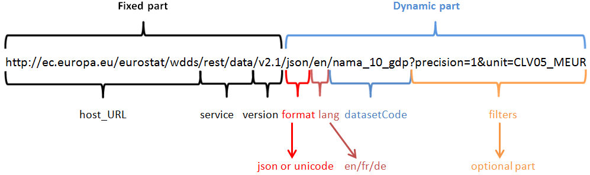

---
jupytext:
  text_representation:
    extension: .md
    format_name: myst
    format_version: 0.13
    jupytext_version: 1.17.0
kernelspec:
  display_name: Python 3 (ipykernel)
  language: python
  name: python3
---

+++ {"slideshow": {"slide_type": "slide"}}

# Hente data programmatisk

* Så langt har vi bladd igjennom statistikkbanken til ssb, funnet data vi er interessert i.
* Deretter har vi lastet det ned som csv-fil og lest det inn til pandas
 

+++ {"slideshow": {"slide_type": "fragment"}}

* Dersom dataen er ferskvare, feks de forskjellige vareindeksene på ssb, valutakurser, aksjekurser osv har vi ikke tid til å laste ned dataen manuelt hver gang

+++ {"slideshow": {"slide_type": "fragment"}}

* Da vil vi at python skal hente inn dataen for oss. 
* Vi kan for eksempel lage en valutakalkulator som automatisk henter inn de nyeste valutakursene
* For å se på hvordan dette kan gjøres i python må vi undersøke hvordan datanettverk er bygd opp

+++ {"slideshow": {"slide_type": "slide"}}

# OSI-modellen:


* Hvert lag i OSI-modellen har protokoller/måter å løse sine oppgaver på.
* For å hente data fra nettet bruker vi en protokoll i lag 7: **h**yper**t**ext **t**ransfer **p**rotocol

+++ {"slideshow": {"slide_type": "subslide"}}

## Http: Hyptertext transfer protocol


 * Http protokollen består av et sett regler/fremgangsmåter som følges av *klient* og *server*
 * Når vi skal laste inn en nettside, feks nrk.no, sender vi en *http-request* til nrk.no webserveren
 * nrk.no leser denne og sender tilbake en *http-respons* som inneholder diverse data pluss nettsiden i html-format
 * Nettleseren vår kan da vise nettsiden til nrk.no

+++ {"slideshow": {"slide_type": "slide"}}

# HTTP-request


* Vi har et lite antall request-metoder, vi trenger:
    - *GET*: Ber om data eller en annen ressurs på webserver
    - *PUT*: Gir webserveren noe data som den skal gjøre noe med

+++ {"slideshow": {"slide_type": "subslide"}}

# HTTP-request


 * Metodene består i alle tilfeller av 4 deler:
     - requestlinjen: GET/POST + ressurs-URI + HTTP-versjon
     - requestheaders: flere linjer av typen: *header-name: header-value*
     - en tom linje markerer slutt på headerern
     - data

+++ {"slideshow": {"slide_type": "slide"}}

# HTTP-respons


* Responsen har også 4 deler:
    - Statuslinje
    - Responsheadere
    - blank linje
    - data

+++ {"slideshow": {"slide_type": "subslide"}}

# Responskoder

* Statuslinjen gir en responskode med 3 siffer.
* Responskoder under 400 betyr at ting har gått greit.
* Du har kanskje sett:
    - 404: not found
    - 403: forbidden
* Dersom alt gikk greit sendes *200 OK*

+++ {"slideshow": {"slide_type": "subslide"}}


+++ {"slideshow": {"slide_type": "slide"}}

# Web API


* Vi skal hente data fra ulike kilder ved å sende http-requests til forskjellige *web-apier*
* API er en forkortelse for **a**plication **p**rogramming **i**nterface og er en type protokoll eller måte for to programmer å snakke sammen
* I et webapi dreier det seg om kommunikasjon mellom en klient (pythonprogrammet ditt) og en server (ssb, eurostat etc)
* De kommer i mange former, et vanlig type API er bygget på REST-prinsipper

+++ {"slideshow": {"slide_type": "subslide"}}


* Et http-request til et REST-API består av:
    - http-metode (GET PUT)
    - Et URL-endepunkt
    - Parametre/data
* Web-APIer gir typisk tilbake data i *xml* eller *json* format.
* Vi skal konsentrere oss om JSON

+++ {"slideshow": {"slide_type": "slide"}}

# JSON
* JSON er forkortelse for javascript object notation
* Det har nesten helt identisk form som et dictionary i python
* Noen forskjeller:
    - `None`er erstattet med `null`
    - `True/False` er erstattet med `true/false`

```{code-cell} ipython3
---
slideshow:
  slide_type: fragment
---
import json

minDict = {"Alder": 32,
           "Ansatt": True,
           "Verv": None,
           "fag": ["matematikk", "programmering"]
}

#json.dumps(dict) - printer ut dictionary som json-streng
print(json.dumps(minDict))
```

+++ {"editable": true, "slideshow": {"slide_type": "subslide"}}

#### Nyttiger json-funksjoner
* `json.dump(fil, dictionary)` - skriver dictionary til json-fil
* `dictionary =json.load(fil)` - leser inn jsonfil til dictionary
* `dictionary =json.loads("strengrep av json objekt")` - leser json-streng til dict
* `tekst_rep = json.dumps(dictionary)` skriver dictionary til json-formatert tekststreng

```{code-cell} ipython3
# Eksempler
json_tekst = json.dumps(minDict) # Skriv dict om til json-formatert tekst
nyDict = json.loads(json_tekst) # Les json-formatert tekst til dict

with open("test.json", "w") as file: #Åpne fil "test.json" - vi skal skrive til filen (write = "w")
    json.dump(nyDict,file) # Skriv dictionary til json-fil

with open("test.json", "r") as file: #Åpne fil "test.json" - vi skal lese filen (read = "r")
    sisteDict = json.load(file)
sisteDict
```

+++ {"editable": true, "slideshow": {"slide_type": "subslide"}}

# URL -- Uniform resource locator

`https://www.ntnu.no/sok?query=IIRA2001&category=all&sortby=magic`

* En url har flere deler: `protokoll://host/path?spørring`
* Protokollen er som regel `http://` (hypertext transfer protocoll)
  * Det finnes andre, feks `ftp`(file transfer protocoll)
* host er er "tjeneren" `feks www.nrk.no`, eller `www.ntnu.no`
* path er en sti på tjeneren feks `studies/courses/IIRA2001` er path til emnet på tjeneren ntnu.edu
* `?` Kalles en *separator* og bak separatoren kan vi "legge til litt data" eller en spørring
  * *Kalles typisk parametre*

+++ {"slideshow": {"slide_type": "slide"}}

## URL



* Figuren viser et api-url fra eurostat
* Alt frem til spørsmålstegnet er api-endepunktet
* Spørsmålstegnet i url'en kalles en separator
* Bak separator i url kan man legge ved forskjellige *parametre*
     - Parameterverdiene har en egen tegnkoding `urlencoding`
     - De har form: `...?variabel1=verdi&variabel=verdi2`

+++ {"slideshow": {"slide_type": "slide"}}

# Hvordan?

* Hvordan parametre, url-endepunkt, http-metoder osv skal se ut er det web-api som bestemmer
* Skal vi bruke et web-api **MÅ VI LESE DOKUMENTASJONEN TIL API'ET**
    - Det forteller oss hvordan det skal brukes
    - Bruker ofte å være gode
    - Eksempler kan ofte finnes i python med `urllib` eller `requests` bibliotek
    - Eksempler på bruk også ofte gitt med `cURL`(et kommandolinjeverktøy)
* Noen API'er har også verktøy som lar deg bygge riktig url med et grafisk grensesnitt (feks SSB)

+++

# Eksempelvis:

* [Trivia/quiz API](https://opentdb.com)

Vi fikk følgende url:
https://opentdb.com/api.php?amount=10&category=11

Vi kan bruke [CURL](https://reqbin.com/curl) til å sende api-spørringen/HTTP requestet

+++


+++ {"slideshow": {"slide_type": "subslide"}}

* Vi skal ikke bruke *curl*, men mange api'er bruker det i tutorials.
* Vi trenger kanskje å lese ut hva som er headere, parametre, url-endepunkt og data
    - `curl -G -d "parameter=value" http:/test.com/api` sender en GET request til `http:/test.com/api?parameter=value`

+++ {"slideshow": {"slide_type": "fragment"}}

* Finner dere et kult API dere vil bruke og dokumentasjon/tutorials er gitt med curl kan dere spørre studass

+++ {"editable": true, "slideshow": {"slide_type": "slide"}}

# http requests i python!

* Da er vi klare til å bruke et web-api i python
* Der er 2 populære bibliotek:`urllib` og `requests`
* Vi anbefaler å bruke `requests`
* La oss gjøre noen sidesøk i wikipedia med python
* wikipedia API [her](https://www.mediawiki.org/wiki/API:REST_API)

```{code-cell} ipython3
---
editable: true
slideshow:
  slide_type: subslide
---
import urllib
import json

limit = 5
query = input("Hva vil du søke etter?\n")
query_urlencoded = urllib.parse.quote(query)
url = f"https://en.wikipedia.org/w/rest.php/v1/search/page?q={query_urlencoded}&limit={limit}"

response = urllib.request.urlopen(url) #"åpne" url og motta resultat
data = response.read() #hent data
data_str = data.decode('utf-8')
data_dict = json.loads(data_str)

for page in data_dict["pages"]:
    print(page["title"], ":")
    print("------------------")
    print(page["description"],"\n\n")

print(query_urlencoded)
```

```{code-cell} ipython3
---
editable: true
slideshow:
  slide_type: ''
---
#Anbefaler å bruke requests
#!pip install requests_toolbelt
import requests
from requests_toolbelt.utils import dump #Fordi jeg vil undersøke nøyaktig hva som blir sendt
import pprint

pp = pprint.PrettyPrinter(indent=4)

search =input("Hva vil du søke etter?\n")

#URL endepunkt sidesøk på wiki-api 
url_endpoint = "https://en.wikipedia.org/w/rest.php/v1/search/page"

#Søkeresultat
num_results = 5

# Med requests lager vi dictionaries med headere og parametere
parameters = {"q": search, "limit": num_results}

# requests fyller ut mange headere automatisk også
header = {"Connection": "Close"}

#Send get-request
response = requests.get(url_endpoint, headers=header, params=parameters)
req = requests.Request("get", url_endpoint, headers=header, params=parameters)

http_melding = dump.dump_all(response)
pp.pprint(http_melding.decode('utf-8'))

#print("Tilgjenglige metoder til responsen: ", dir(response))

data = response.json() # Dersom vi får json tilbake
#data = resonse.text # Dersom vi får noe annet enn json tilbake

print("\n\nExit code:", response.status_code)
print("URL: ", response.url)
print("headers", response.headers)

for page in data["pages"]:
    print(page["title"], ":")
    print("------------------")
    print(page["description"],"\n\n")
```

+++ {"editable": true, "slideshow": {"slide_type": ""}}

# Eurostats api:

* Eurostat api: [https://ec.europa.eu/eurostat/web/user-guides/data-browser/api-data-access/api-detailed-guidelines/api-statistics](https://ec.europa.eu/eurostat/web/user-guides/data-browser/api-data-access/api-detailed-guidelines/api-statistics)

```{code-cell} ipython3
---
editable: true
slideshow:
  slide_type: ''
---
import requests
import pprint

pp = pprint.PrettyPrinter()

tabell = "nama_10_gdp"
url_endpoint  = f"https://ec.europa.eu/eurostat/api/dissemination/statistics/1.0/data/{tabell}"
parameters = {
    "format": "JSON",
    "lang": "EN",
    "sinceTimePeriod": 2019
}

response = requests.get(url_endpoint, params=parameters)
data = response.json()
pp.pprint(data)
```

# JSON-stat

* Man får gjerne statistisk data tilbake i json_stat-format
* Vi kan bruke `pyjstat` til å lese data inn til pandas
* Eurostat og ssb anbefaler json_stat format

```{code-cell} ipython3
#!pip install pyjstat
from pyjstat import pyjstat
import pandas as pd


#dataset = pyjstat.Dataset.read(json.dumps(data))
dataset = pyjstat.Dataset.read(response.text) #Les data som json-streng, ikke dict-objekt
tittel = dataset["label"]
GDP_id = dataset.write('dataframe', naming='id')
GDP_df = dataset.write('dataframe')
GDP_orig = pd.DataFrame(GDP_df, copy=True)
```

```{code-cell} ipython3
GDP_df = GDP_orig

GDP_df["Time frequency"].unique
#Kun årlige tall - vi dropper hele kolonnen
GDP_df = GDP_df.drop(columns="Time frequency")

GDP_df = GDP_df.astype({"value": "float64"})
GDP_df["Time"] = pd.PeriodIndex(GDP_df["Time"], freq="Y")

GDP_df["Unit of measure"].unique()
enhet = ['Chain linked volumes, index 2020=100',
      'Previous year prices, million euro']
GDP_df.query("`Unit of measure` in @enhet")

GDP_df["National accounts indicator (ESA 2010)"].unique()

GDP_df = GDP_df.query("`National accounts indicator (ESA 2010)` == 'Compensation of employees'").drop(columns="National accounts indicator (ESA 2010)")
GDP_df = GDP_df.dropna()
GDP_df = GDP_df.rename(columns={"Geopolitical entity (reporting)": "region"})
GDP_df = GDP_df.pivot(columns="Unit of measure", index=["region", "Time"], values="value")
GDP_df
```

```{code-cell} ipython3
import matplotlib.pyplot as plt
top10_GDP = GDP_df.xs("2023", level="Time")\
    .query("not region.str.contains('Euro')")\
    .sort_values("Current prices, million euro", ascending=False)\
    .head(10)

top10_GDP
top10_GDP.plot.pie(y="Current prices, million euro", legend=False)
```

```{code-cell} ipython3

```
