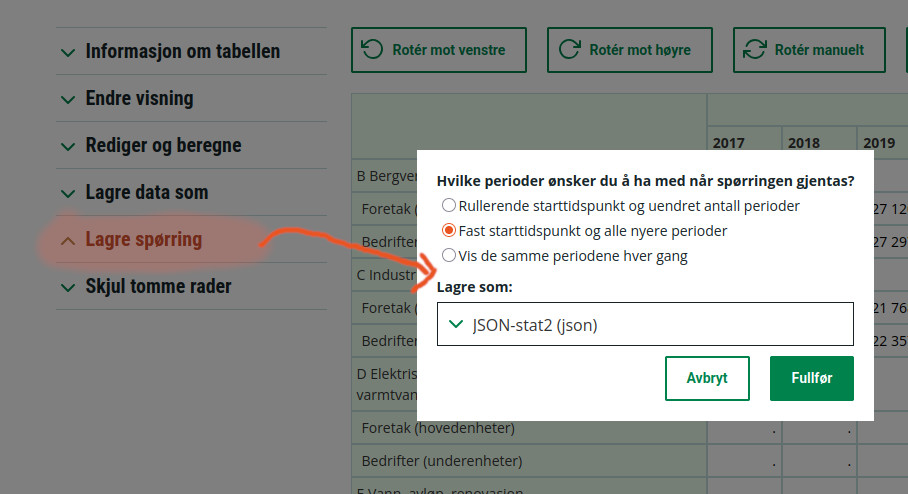
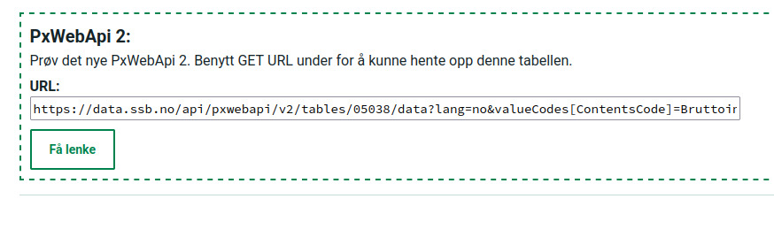

---
jupyter:
  jupytext:
    formats: ipynb,md
    text_representation:
      extension: .md
      format_name: markdown
      format_version: '1.3'
      jupytext_version: 1.18.1
  kernelspec:
    display_name: Python 3 (ipykernel)
    language: python
    name: python3
---

# Web API


* API = *Application programming interface* : Beskriver hvordan vi bruke feks en ressurs, pakke eller et bibliotek
* WebAPI: Et grensesnitt som beskriver hvordan vi får tilgang til en ressurs over internett
* I vår kontekst dreier det seg oftest om en måte hvor en klient (pyton-programmet vårt) skal snakke med en webserver (ssb, eurostat) og få tak i data

Andre eksempler kan være:
* OpenAI sitt Web API lar oss bruke chatGPT gjennom Python-kode
* Spotify sitt Web API lar oss styre avspilling av spotifykontoen vår
* Reddit/x/twitter og andre sosiale media har ofte også WebAPI som lar oss poste eller lese innhold med feks python


## REST API
* En spesiell type Web API er et*REST*-API (eller *RESTful API*)
* REST = REpresentational State Transfer:
  * Klienter ber om ressurser gjennom en HTTP metode (feks GET, POST)
  * Hver ressurs har en egen URL ofte kalte et endepunkt eller *endpoint*
  * Serveren sender en *representasjon* av denne ressursen (typisk JSON)
  * Forespørslene inneholder alt webserveren trenger for å svare -- kommunikasjonen kalles derfor *stateless* (Ingen vedvarende innlogging eller pågående sesjon mellom klient og server)


## Bruk
For å ta i bruk et REST-API bør vi kunne litt om:
* HTTP-protokollen
* Oppbygging av en URL
* JSON-formatet, og jsonstat-formatet med `pyjstat`
* Bruk av `requests` biblioteket til å sende http-spørringer

Når det er på plass kan man ta i bruk mange kule ressurser!
Se feks:
* [https://free-apis.github.io/#/categories](https://free-apis.github.io/#/categories)
* [https://github.com/public-apis/public-apis](https://github.com/public-apis/public-apis)

```python
import requests, json
from pyjstat import pyjstat
import pandas as pd
```

## SSB
* SSB Lager nytt grensesnitt for sitt WebAPI!
* Det er ikke helt klart enda - Vi dropper å se på den gamle måten med `post`-spørringer
* Man kan etterhvert bygge en egen spørring mot en tabell og presisere hvilke statistikkvariabler og tidsrom man er ute etter

Per nå anbefaler vi disse 2 måtene:
* I begge tilfeller blar du gjennom statistikkbanken og henter fram dataene du vil laste inn
* Deretter kan du
  1. Trykke lagre spørring for denne tabellen, be om tidsrom og lagre lenken
  2. Bla nederst på siden og lagre **PxWebAPi 2** URL







```python
#Metode 1

url_byggekost = "https://www.ssb.no/statbank/sq/10116082"
response = requests.get(url_byggekost)
print("Statuskode:", response.status_code)
```

```python
# Vi undersøker innholdet litt
#response.json()
```

```python
#Metode 2
url = "https://data.ssb.no/api/pxwebapi/v2/tables/08651/data?lang=no&valueCodes[Arbeidstype]=01,02,03&valueCodes[Tid]=1978M01,1978M02,1978M03,1978M04,1978M05,1978M06,1978M07,1978M08,1978M09,1978M10,1978M11,1978M12,1979M01,1979M02,1979M03,1979M04,1979M05,1979M06,1979M07,1979M08,1979M09,1979M10,1979M11,1979M12,1980M01,1980M02,1980M03,1980M04,1980M05,1980M06,1980M07,1980M08,1980M09,1980M10,1980M11,1980M12,1981M01,1981M02,1981M03,1981M04,1981M05,1981M06,1981M07,1981M08,1981M09,1981M10,1981M11,1981M12,1982M01,1982M02,1982M03,1982M04,1982M05,1982M06,1982M07,1982M08,1982M09,1982M10,1982M11,1982M12,1983M01,1983M02,1983M03,1983M04,1983M05,1983M06,1983M07,1983M08,1983M09,1983M10,1983M11,1983M12,1984M01,1984M02,1984M03,1984M04,1984M05,1984M06,1984M07,1984M08,1984M09,1984M10,1984M11,1984M12,1985M01,1985M02,1985M03,1985M04,1985M05,1985M06,1985M07,1985M08,1985M09,1985M10,1985M11,1985M12,1986M01,1986M02,1986M03,1986M04,1986M05,1986M06,1986M07,1986M08,1986M09,1986M10,1986M11,1986M12,1987M01,1987M02,1987M03,1987M04,1987M05,1987M06,1987M07,1987M08,1987M09,1987M10,1987M11,1987M12,1988M01,1988M02,1988M03,1988M04,1988M05,1988M06,1988M07,1988M08,1988M09,1988M10,1988M11,1988M12,1989M01,1989M02,1989M03,1989M04,1989M05,1989M06,1989M07,1989M08,1989M09,1989M10,1989M11,1989M12,1990M01,1990M02,1990M03,1990M04,1990M05,1990M06,1990M07,1990M08,1990M09,1990M10,1990M11,1990M12,1991M01,1991M02,1991M03,1991M04,1991M05,1991M06,1991M07,1991M08,1991M09,1991M10,1991M11,1991M12,1992M01,1992M02,1992M03,1992M04,1992M05,1992M06,1992M07,1992M08,1992M09,1992M10,1992M11,1992M12,1993M01,1993M02,1993M03,1993M04,1993M05,1993M06,1993M07,1993M08,1993M09,1993M10,1993M11,1993M12,1994M01,1994M02,1994M03,1994M04,1994M05,1994M06,1994M07,1994M08,1994M09,1994M10,1994M11,1994M12,1995M01,1995M02,1995M03,1995M04,1995M05,1995M06,1995M07,1995M08,1995M09,1995M10,1995M11,1995M12,1996M01,1996M02,1996M03,1996M04,1996M05,1996M06,1996M07,1996M08,1996M09,1996M10,1996M11,1996M12,1997M01,1997M02,1997M03,1997M04,1997M05,1997M06,1997M07,1997M08,1997M09,1997M10,1997M11,1997M12,1998M01,1998M02,1998M03,1998M04,1998M05,1998M06,1998M07,1998M08,1998M09,1998M10,1998M11,1998M12,1999M01,1999M02,1999M03,1999M04,1999M05,1999M06,1999M07,1999M08,1999M09,1999M10,1999M11,1999M12,2000M01,2000M02,2000M03,2000M04,2000M05,2000M06,2000M07,2000M08,2000M09,2000M10,2000M11,2000M12,2001M01,2001M02,2001M03,2001M04,2001M05,2001M06,2001M07,2001M08,2001M09,2001M10,2001M11,2001M12,2002M01,2002M02,2002M03,2002M04,2002M05,2002M06,2002M07,2002M08,2002M09,2002M10,2002M11,2002M12,2003M01,2003M02,2003M03,2003M04,2003M05,2003M06,2003M07,2003M08,2003M09,2003M10,2003M11,2003M12,2004M01,2004M02,2004M03,2004M04,2004M05,2004M06,2004M07,2004M08,2004M09,2004M10,2004M11,2004M12,2005M01,2005M02,2005M03,2005M04,2005M05,2005M06,2005M07,2005M08,2005M09,2005M10,2005M11,2005M12,2006M01,2006M02,2006M03,2006M04,2006M05,2006M06,2006M07,2006M08,2006M09,2006M10,2006M11,2006M12,2007M01,2007M02,2007M03,2007M04,2007M05,2007M06,2007M07,2007M08,2007M09,2007M10,2007M11,2007M12,2008M01,2008M02,2008M03,2008M04,2008M05,2008M06,2008M07,2008M08,2008M09,2008M10,2008M11,2008M12,2009M01,2009M02,2009M03,2009M04,2009M05,2009M06,2009M07,2009M08,2009M09,2009M10,2009M11,2009M12,2010M01,2010M02,2010M03,2010M04,2010M05,2010M06,2010M07,2010M08,2010M09,2010M10,2010M11,2010M12,2011M01,2011M02,2011M03,2011M04,2011M05,2011M06,2011M07,2011M08,2011M09,2011M10,2011M11,2011M12,2012M01,2012M02,2012M03,2012M04,2012M05,2012M06,2012M07,2012M08,2012M09,2012M10,2012M11,2012M12,2013M01,2013M02,2013M03,2013M04,2013M05,2013M06,2013M07,2013M08,2013M09,2013M10,2013M11,2013M12,2014M01,2014M02,2014M03,2014M04,2014M05,2014M06,2014M07,2014M08,2014M09,2014M10,2014M11,2014M12,2015M01,2015M02,2015M03,2015M04,2015M05,2015M06,2015M07,2015M08,2015M09,2015M10,2015M11,2015M12,2016M01,2016M02,2016M03,2016M04,2016M05,2016M06,2016M07,2016M08,2016M09,2016M10,2016M11,2016M12,2017M01,2017M02,2017M03,2017M04,2017M05,2017M06,2017M07,2017M08,2017M09,2017M10,2017M11,2017M12,2018M01,2018M02,2018M03,2018M04,2018M05,2018M06,2018M07,2018M08,2018M09,2018M10,2018M11,2018M12,2019M01,2019M02,2019M03,2019M04,2019M05,2019M06,2019M07,2019M08,2019M09,2019M10,2019M11,2019M12,2020M01,2020M02,2020M03,2020M04,2020M05,2020M06,2020M07,2020M08,2020M09,2020M10,2020M11,2020M12,2021M01,2021M02,2021M03,2021M04,2021M05,2021M06,2021M07,2021M08,2021M09,2021M10,2021M11,2021M12,2022M01,2022M02,2022M03,2022M04,2022M05,2022M06,2022M07,2022M08,2022M09,2022M10,2022M11,2022M12,2023M01,2023M02,2023M03,2023M04,2023M05,2023M06,2023M07,2023M08,2023M09,2023M10,2023M11,2023M12,2024M01,2024M02,2024M03,2024M04,2024M05,2024M06,2024M07,2024M08,2024M09,2024M10,2024M11,2024M12,2025M01,2025M02,2025M03,2025M04,2025M05,2025M06,2025M07,2025M08,2025M09&valueCodes[ContentsCode]=Byggindeks,EndrForrMnd,EndrForrAar"
requests.get(url)
response.status_code
```

```python
dataset = pyjstat.Dataset.read(response.text)
df = dataset.write("dataframe")

df["måned"] = df["måned"].str.replace("M","-")
df["måned"] = pd.PeriodIndex(df["måned"], freq="M")
df
```

# Melt og Pivot
* Dere har sikkert merket at man ofte trenger å endre på formen til dataene våres.
* `melt` og `pivot` er meget nyttige funksjoner til dette formålet

 


## Pivot
* Jsonstat gir en "flat" struktur på dataene.
* Dersom vi vil gjør formatet "bredere" (lage en pivot-tabell) kan vi bruke `df.pivot(...)`
* Typisk ser dette slik ut:
```
df_pivotert = df.pivot(index=..., columns=..., values=...)
```
* Her er `index` navn på kolonnen som være indeksen (eller en liste med navn på kolonnene)
* `columns` er kolonnen hvis verdier vi skal "pivotere" opp
* `values` er kolonnen som inneholder verdiene

Funksjonen er litt ekkel -- og som regel blir det litt prøving og feiling

```python
# Eksempel fra ssb
df_pivotert = df
df_pivotert = df_pivotert[df_pivotert["arbeidstype"] == "I alt"]
df_pivotert  = df_pivotert.pivot(index="måned", columns="statistikkvariabel", values="value")
df_pivotert
```

## Melt
* `melt` gjør det motsatte av `pivot`
* Vi "smelter" dataframen slik den blir «lang» heller enn «bred»
* Typisk bruk ser slik ut:
```
df.melt(id_vars=[...], value_vars=None, var_name=..., value_name=...) 
```
* id_vars er her kolonnene som skal være "id-variabler" -- de vi ikke skal gjøre noe med
* value_vars er kolonnene som skal være "verdivariabler" -- altså de som skal smeltes
  * Når denne ikke oppgis smeltes alle kolonner som ikke er i id_vars
* var_name, og value_name er navnet på de nye kolonnene, disse kan vi også sette etterpå

Meltfunksjonen er også litt ekkel og behøver litt prøving og feiling (og hjelp fra KI :) ) 


```python
df_pivotert.melt() # Funker dårlig -- indeks har forsvunnet
df_pivotert.melt(ignore_index = False)#Funker
```

```python
# Melt med id_vars osv
df_pivotert.reset_index().melt(id_vars="måned", value_vars = None, var_name="statvar", value_name="Prosent")
```

```python
import matplotlib.pyplot as plt

df = pd.read_csv("05307_roykere.csv", sep="\t", encoding="ISO-8859-1")

# SMELT 
df= df.melt(id_vars=["kjønn", "alder", "år"], var_name="statistikkvariabel", value_name="Prosent")
df = df[df["statistikkvariabel"].str.contains("røyk")]
df = df.astype({"Prosent": "float64"})
df["år"] = pd.PeriodIndex(df["år"], freq="Y")
df = df[df["kjønn"].str.contains("Begge")]

df = df.pivot(index=["statistikkvariabel", "år"], columns="alder", values="Prosent").reset_index()
df = df.set_index("år")

# Plot utviklign dagligrøykere
df[df["statistikkvariabel"].str.contains("daglig")].plot()


# Plot utvikling av-og-til-røykere
df[df["statistikkvariabel"].str.contains("av-og")].plot()
```

```python
df.loc["1990"].iloc[0].iloc[1:].plot.bar() # Ekkel måte å slå opp i data på --> bedre med multiindex
```

```python
# Multiindex-eksempel med indexslice
df = df.reset_index().set_index(["statistikkvariabel", "år"])
idx = pd.IndexSlice
df.loc[idx[:,"1985"], :].T.plot.bar()

#MEd crosstable
df.xs("1985", level=1).plot.bar()
df.xs("1985", level=1).T.plot.bar()


```
