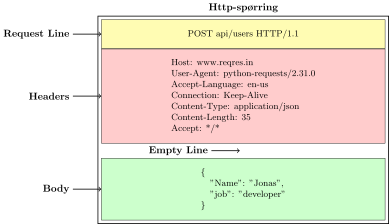

---
jupyter:
  jupytext:
    formats: ipynb,md
    text_representation:
      extension: .md
      format_name: markdown
      format_version: '1.3'
      jupytext_version: 1.18.1
  kernelspec:
    display_name: Python 3 (ipykernel)
    language: python
    name: python3
---

# WebAPI og requests


*Vi antar vi kan litt om http-protokollen og hvordan en URL er bygget opp*


## Sende http-spørring med `requests`

For å kunne sende en httpspørring må vi:
* Vite hvilken tjener vi skal sende det til (eks www.ssb.no)
* Vite *hvor* på tjeneren ressursen vi spør etter er
* Vite om det skal være en GET/PUT/POST spørring
* Vite hvilke parametre som skal være med
* Vite om vi skal sende med noe i headeren til spørringen (API-nøkler, brukernavn og passord etc)

Når vi vet dette, kan `requests` sette sammen spørringen og sende den på riktig vis


<!-- #region -->
## Bruk av `requests`

Under er typisk gang i bruk av requests -- ikke kjørbar kode, men en cheat-sheet

```python
import requests

url = #tjener OG sti på tjeneren
parametere = # Dictionary med parameternavn: verdi
headere = #Dictionary med headere felt: verdi
data_payload = #Data som skal sendes ved -- i tilfelle POST

response = requests.get(url, params = parametere, headers = headere) # GET request
response = requests.post(url, params = parametere, headers = headere, data=data_payload) # POST request

print("statuskode", response.status_code)
print("Headere (til respons)", response.headers)
print("responstype:", response.headers['content-type']) # Dersom tilgjengerlig (feks application/json)

## Data kan leses på flere måer
data = response.json() #Dersom responsdata er i jsonformat
data = response.text #Tegnkoding ordnes som regel automatisk
data = response.content.decode("latin1") # Dersom det er feil med automatisk tegnkoding
```


<!-- #endregion -->

Vi bruker altså `requests.get` eller `requests.post` til å sende spørringen,
mens headere og url-parametere lages som dictionaries og gis som argumenter (`params=`, `headers=`) til `requests.get`/`requests.post`. Biblioteket kan nå ta seg av å bygge den faktiske http-spørringer som ser noe slikt ut:




<!-- #region -->
Etter å ha sendt spørringen ordner `requests` bibiloteket et responseobjekt til oss
som vi ofte kaller `res` eller `response`. Tabellen under gir en oversikt over attributter og metoder til dette responsobjektet


| Egenskap / Metode | Type | Beskrivelse | Eksempel på bruk |
| :--- | :--- | :--- | :--- |
| `.status_code` | Attributt | Viser HTTP-statuskoden fra serveren (f.eks. `200` for OK, eller `404` for Ikke funnet). | `print(res.status_code)` |
| `.ok` | Attributt | En praktisk snarvei som er `True` hvis forespørselen var vellykket (statuskode 200–299). | `if res.ok:` |
| `.raise_for_status()`| Metode | **Viktig for feilhåndtering!** Krasjer programmet (kaster en feil) hvis forespørselen feilet. Slik unngår du at koden kjører videre med tomme data. | `res.raise_for_status()` |
| `.url` | Attributt | Viser den endelige URL-en som ble sendt (inkludert alt du la til i `params`). Utrolig nyttig for feilsøking! | `print(res.url)` |
| `.headers` | Attributt | En dictionary med metadata som *serveren* sendte tilbake. Kan inneholde info om datamatype eller gjenværende API-kvote. | `print(res.headers["Content-Type"])` |
| `.json()` | Metode | Gjør automatisk serverens JSON-tekst om til en ferdig Python-dictionary (deserialisering). | `data = res.json()` |
| `.text` | Attributt | Returnerer serverens svar som rå, ubehandlet tekst. Veldig nyttig for feilsøking hvis `.json()` feiler! | `print(res.text)` |

<!-- #endregion -->

## Httpbin.org

- httpbin er en webressurs vi kan bruke til å teste spørringene våres
- Den tar imot GET/POST spørringer, og sender tilbake data om hva den mottok

```python
import requests
```

```python

url_httpbin = "https://httpbin.org/get" #url for å test GET-spørringer
response = requests.get(url_httpbin)
print("Statuskode", response.status_code)
print("Svarheadere", response.headers)

#Data om spørringen som ble sendt legges ved som svar
data = response.json()  #Henter ut data -- mer om json lenger nede
print("Parametre", data["args"])
print("Headere:", data["headers"])
```

::: {hint}
Dersom du lar en dictionary-variabel «henge» på slutten av en kodecelle
vil den bli vist med litt penere formatering enn om du bruker `print`
:::


Vi kan legge ved parametre og headere for å sjekke hvordan spørringer vi sender ser ut:

```python
url_httpbin = "https://httpbin.org/post" #url for å test POST-spørringer

mine_parametre = {"query": "Donald duck ruler", 
                  "lang": "EN", 
                  "min": "parameter"}
mine_headere = {"User-Agent": "Superscript-requests-tester1.1"}

data_payload = """ 
HTTP står ved døra: «Hei, er du klar?»
med metode i lomma og URI på svar.
GET henter fredelig, POST sier «jeg sender!»
PUT gjør det helt om, mens PATCH bare endrer.

En klient på tur med en socket så fin,
den banker på server’n: «Kan jeg slippe inn?»
Et request går av gårde i linje og bånd,
med headers som merkelapp, «Content-Type» på hånd.
"""

response = requests.post(url_httpbin,
                       params = mine_parametre, 
                       headers=mine_headere,
                       data = data_payload)
print("Statuskode", response.status_code)
print("Svarheadere", response.headers)

#Data om spørringen som ble sendt legges ved som svar
data = response.json() #Henter ut data -- mer om json lenger nede
print("Parametre jeg brukte", data["args"])
print("Header om user-agent:", data["headers"]["User-Agent"])
print("Data jeg sendte", data["data"])
```

::: {admonition} Oppgave
Sjekk at du kan bruke `requests`-biblioteket til å sende `GET`og `POST` spørringer til:
 - httpbin.org/get
 - httpbin.org/post

Legg ved noen egne parametere, headere og, til `POST`, legg ved noe data og sjekk:
1. Hvilken URL bygde requests? Kjenner du igjen parameterene du brukte?
2. Hvilke headere ble sendt? Finner du din egen header?
3. Hvilke data mottok httpbin? sjekk at du finner de igjen i svaret fra httpbin
:::
