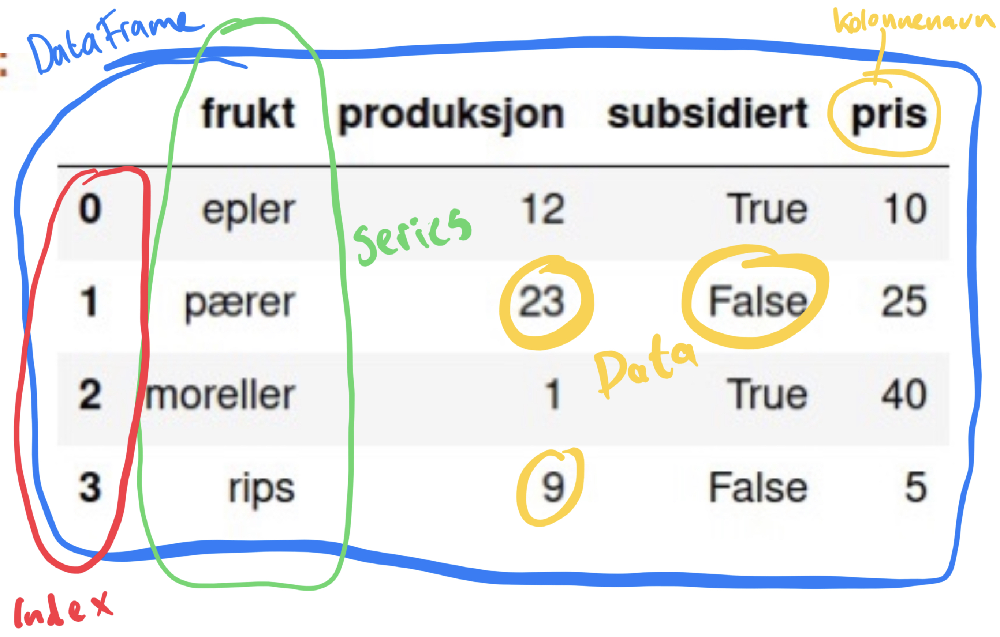
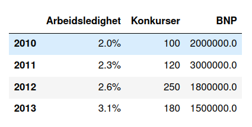

---
jupytext:
  text_representation:
    extension: .md
    format_name: myst
    format_version: 0.13
    jupytext_version: 1.17.0
kernelspec:
  display_name: Python 3 (ipykernel)
  language: python
  name: python3
---

+++ {"editable": true, "slideshow": {"slide_type": "slide"}}



+++ {"editable": true, "slideshow": {"slide_type": "subslide"}}

### Oppgave 3:


Under har vi et lite pandas dataframe.


Prøv å lage tabellen ved å bruke metodene over


+++ {"editable": true, "slideshow": {"slide_type": "subslide"}}

### Series
* Vi lagde pandas `Series` med `pd.Series(data=None, index=None, dtype=None, name=None, copy=None)`
* Når argumentene står som feks `index = None` betyr det at den ikke er obligatorisk å ha med når vi lager et `Series`-objekt
* Dersom vi ikke tar de med får de verdien `None` som «default»

```{code-cell} ipython3
---
editable: true
slideshow:
  slide_type: subslide
---
import pandas as pd
import numpy as np
indeks = range(2010, 2014)
arbeidsledighet = pd.Series(data=[0.02, 0.023, 0.026, 0.031], index=indeks, name="Arbeidsledighet")
konkurser = pd.Series([100,120,250,180], indeks, name="Konkurser") #vi kan droppe data=..., index=... så lenge vi gir data i riktig rekkefølge
BNPdata = np.array([2e6, 3e6, 1.8e6, 1.5e6]) #Det er ofte lurt å ha viktige argmuenter til series som egne variabler
BNP = pd.Series(BNPdata, indeks, name="BNP", copy=True)
BNPdata[0] = 2.1e6 # Ofte er data til Series eller DataFrame ikke kopiert inn -- men lagret som referanser til originaldata
BNP
```

+++ {"editable": true, "slideshow": {"slide_type": "subslide"}}

### DataFrame

* Vi lagde pandas dataframes med `pd.DataFrame(data=None, index=None, columns=None, dtype=None, copy=None)`
* Her er `columns` nytt -- den gir navnene til kolonnene i "tabellen" vår dersom de mangler fra `data`
* Dersom kolonnenavnene er gitt fra `data` bruker vi `columns` til å velge ut hvilke kolonner vi vil ha i dataframet vårt

+++ {"editable": true, "slideshow": {"slide_type": "subslide"}}

### DataFrame-- data

* `data` til Series var 1-dimensjonal, men i en dataframe må vi oppgi (sannsynligvis) flere dataserier som kolonner
* Den mest vanlige måten er med en dictionary: ` data = {"Kolonne1": data1, "Kolonne2": data2, ... }`
* Dersom vi har en rekke `Series` som beskriver *radene* har vi `data = [rad1, rad2, ....]` hvor `rad1` er en `Series`

```{code-cell} ipython3
---
editable: true
slideshow:
  slide_type: subslide
---
oppg3_data = {arbeidsledighet.name: arbeidsledighet, konkurser.name: konkurser, BNP.name: BNP}
oppg3_df = pd.DataFrame(oppg3_data)
oppg3_df
```

+++ {"editable": true, "slideshow": {"slide_type": "slide"}}

## Hente ut eller endre deler av DataFrame/Series

+++ {"editable": true, "slideshow": {"slide_type": "fragment"}}

* Når vi har lagt til dataen vår in en dataframe, trenger vi å kunne slå opp i den
* Enten vi vil endre eller bare lese dataene, er det forholdsvis mange måter på gjøre dette på

+++ {"editable": true, "slideshow": {"slide_type": "subslide"}}

### Series
* Vi Kan slå opp med label (etikketter i index) eller med radnummer
* Det kjappeste er å bruke `s["label"]` eller `s[index]` for å slå opp dataen på «label» eller indeks i serien `s`

```{code-cell} ipython3
---
editable: true
slideshow:
  slide_type: fragment
---
BNP_2010 = BNP[2010]
BNP_2010
```

```{code-cell} ipython3
---
editable: true
slideshow:
  slide_type: fragment
---
BNP[2011] = 7e6
BNP
```

```{code-cell} ipython3
---
editable: true
slideshow:
  slide_type: subslide
---
# Series med tekstreng etiketter
s = pd.Series([10, 20, 30, 40, 50, 60], index=['a', 'b', 'c', 'd', 'e', 'f'])
s['a'] = 100  # Modifiserer verdi på label 'a'
```

+++ {"editable": true, "slideshow": {"slide_type": "subslide"}}

* Dersom vi heller vil bruke nummeret enn etikketten bruker vi .iloc(...)

```{code-cell} ipython3
---
editable: true
slideshow:
  slide_type: fragment
---
BNP.iloc[1] # Datapunkt nummer 2
```

+++ {"editable": true, "slideshow": {"slide_type": "subslide"}}

* Vi kan slå opp i flere verdier samtidig ved å gi en liste
  * `s[["label2", "label4"]]` eller `s[[indeks2, indeks4]]`
  * `s.iloc[[indeks4,indeks6]]`

```{code-cell} ipython3
---
editable: true
slideshow:
  slide_type: fragment
---
print(BNP[[2011, 2013]])
print(s[['a', 'c']])
print(BNP.iloc[[0,2]])
```

+++ {"editable": true, "slideshow": {"slide_type": "subslide"}}

#### Skjæring/Slicing
* Ofte vil vi slå opp en rekke eller et spenn med verdier -- feks alle mellom 1995 og 2000
* Da kan vi *skjære* eller *slice*
* Vi slicer på samme måter som vanlige lister `s[start:stop]`
* Start/stop kan være indekser eller etiketter

```{code-cell} ipython3
---
editable: true
slideshow:
  slide_type: subslide
---
print(s['b':'e'])# fra 'b' til og med 'e'
print(s.iloc[1:5]) # fra 1 til men IKKE med 5
```

+++ {"editable": true, "slideshow": {"slide_type": "subslide"}}

Tabellen under oppsummerer flere måter å slå opp i `Series`-objekter på 

| Operasjon                            | Syntaks / Metode                                   | Eksempelkode                                                 | Beskrivelse                                                                 |
|--------------------------------------|----------------------------------------------------|--------------------------------------------------------------|-----------------------------------------------------------------------------|
| Tilgang til et element med indeksering| `s[index]`                                         | `s[0]`                                                       | Returnerer verdien på den spesifikke posisjonen (0-indeksert).              |
| Tilgang til et element med etikett    | `s['label']`                                       | `s['Alice']`                                                 | Returnerer verdien for det spesifikke etikettenavnet.                       |
| Tilgang til flere elementer (liste)   | `s[[index1, index2]]`                              | `s[[0, 2]]`                                                  | Returnerer en ny Serie med verdier for de spesifikke posisjonene.           |
| Tilgang til flere elementer (etiketter)| `s[['label1', 'label2']]`                          | `s[['Alice', 'Bob']]`                                        | Returnerer en ny Serie med verdier for de spesifikke etikettene.            |
| Tilgang til verdi med `.at[]`         | `s.at['label']`                                    | `s.at['Bob']`                                                | Henter en enkelt verdi ved å bruke etikett.                                 |
| Tilgang til verdi med `.iat[]`        | `s.iat[index]`                                     | `s.iat[1]`                                                   | Henter en enkelt verdi ved å bruke indeksposisjon.                          |
| Skjæring (slicing) med etiketter      | `s['start_label':'end_label']`                     | `s['Alice':'Charlie']`                                       | Returnerer verdiene mellom start- og sluttetiketten (inklusiv).             |
| Skjæring (slicing) med indeksering    | `s[start_index:end_index]`                         | `s[0:2]`                                                     | Returnerer verdiene mellom start- og sluttindeks (slutten eksklusiv).       |
| Betinget valg                        | `s[s > value]`                                     | `s[s > 25]`                                                  | Returnerer verdier der betingelsen er oppfylt.                              |
| Tilgang med flere betingelser         | `s[(s > value1) & (s < value2)]`                   | `s[(s > 25) & (s < 35)]`                                     | Returnerer verdier der begge betingelser er oppfylt (`&` for OG).           |
| Verdier i en liste                   | `s[s.isin([list_of_values])]`                      | `s[s.isin([25, 35])]`                                        | Returnerer verdier som er i den oppgitte listen.                            |
| Tilgang til elementer med `.loc[]`    | `s.loc['label']` eller `s.loc[start:end]`          | `s.loc['Alice']` eller `s.loc['Alice':'Charlie']`            | Returnerer verdier med etiketter eller skjæring.                            |
| Tilgang til elementer med `.iloc[]`   | `s.iloc[index]` eller `s.iloc[start:end]`          | `s.iloc[1]` eller `s.iloc[0:2]`                              | Returnerer verdier med indeksering eller skjæring.                          |


+++ {"editable": true, "slideshow": {"slide_type": "subslide"}}

* Fra tabellen ser vi at man kan både bruke `s["label"]` og `s.loc["label"]`
* Med `.loc[]` mener vi eksplisitt at vi skal bruke label, mens `[]` er litt tvetydig
* Med og uten `s[..]` og `s.loc[...]` er identiske i bruk, bortsett fra med slicing
* `s.loc[start:stop]` er fra start til og med stop, mens `s[start:stop]` er fra start til men IKKE med stop
* Andre rare forskjeller kan forekomme, så test begge om rare ting foregår

```{code-cell} ipython3
---
editable: true
slideshow:
  slide_type: subslide
---
BNP.index #BNP har en RangeIndex index
print(BNP[2011:2014]) #Returnerer ingenting
print(BNP.loc[2011:2013]) #Funker som forventet fra/til og med
print(BNP[0:3]) # [] vet ikke om den skal bruke labels eller indeks -- .loc[] gjør det tydelig at det er med labels
```

+++ {"editable": true, "slideshow": {"slide_type": "slide"}}

### DataFrames
* Med DataFrames har vi 2-dimensjonal data.
  * Vi trenger å velge kolonner
  * Vi trenger å velge rader
  * Vi trenger å velge et datapunkt på en (rad, kolonne)

+++ {"editable": true, "slideshow": {"slide_type": "subslide"}}

#### Kolonner
* Vi bruker nå `df["kolonne"]` for å velge en kolonne (Gir en Series)
* Eventuelt `df[["kolonne2", "kolonne4", ...]]` for å velge flere kolonner (Gir et DataFrame)

```{code-cell} ipython3
---
editable: true
slideshow:
  slide_type: fragment
---
df = oppg3_df
df
```

```{code-cell} ipython3
---
editable: true
slideshow:
  slide_type: subslide
---
print(df["Arbeidsledighet"]) #Velg 1 kolonne
df[["Arbeidsledighet", "BNP"]] # Velg flere kolonner
```

+++ {"editable": true, "slideshow": {"slide_type": "subslide"}}

#### Rader
* For de fleste andre operasjoner kan vi bruke en variant med `.loc[]`
* For å velge en eller flere rader, feks:

```{code-cell} ipython3
---
editable: true
slideshow:
  slide_type: fragment
---
print(df.loc[2010]) # Rad med indeks 2010
print(df.loc[[2010, 2011]]) # []-liste med indekser for å få flere rader
df.loc[2011:2013] #Slicing av rader fra -> til og med
```

+++ {"editable": true, "slideshow": {"slide_type": "subslide"}}

#### Rader og Kolonner
* Vi bruker også gjerne `.loc[]` nå man velger både rader og kolonner
* Det har former som:
  * `df.loc[rad, kolonne]` gir datapunkt på rad "rad" og i kolonne "kolonne"
  * `df.loc[start:stop, kolonne]` gir rader fra start til og med stop og verdier i kolonne "kolonne"
  * `df.loc[:, ["kolonne1", "kolonne2"]]` gir alle rader, og kolonner "kolonne1" og "kolonne2"

```{code-cell} ipython3
---
editable: true
slideshow:
  slide_type: subslide
---
print("BNP i 2011 er:", df.loc[2011, "BNP"])
df.loc[2011:2013, "Arbeidsledighet"] #Arbeidsledighet i årene 2011 til og med 2013
df.loc[:, ["Arbeidsledighet", "BNP"]]
```

+++ {"editable": true, "slideshow": {"slide_type": "subslide"}}

#### Tabell: Oppslag i dataframe

| Operasjon                            | Syntaks / Metode                                  | Eksempelkode                                              | Beskrivelse                                                                 |
|--------------------------------------|---------------------------------------------------|------------------------------------------------------------|-----------------------------------------------------------------------------|
| Tilgang til en kolonne               | `df['kolonnenavn']`                               | `df['alder']`                                               | Returnerer en Serie av den valgte kolonnen.                                 |
| Tilgang til flere kolonner           | `df[['kolonne1', 'kolonne2']]`                    | `df[['alder', 'lønn']]`                                     | Returnerer en DataFrame av de valgte kolonnene.                             |
| Tilgang til en rad med `.loc[]`      | `df.loc[indeks]`                                  | `df.loc[0]`                                                 | Returnerer en Serie for den spesifiserte raden ved etikett eller indeks.    |
| Tilgang til en rad med `.iloc[]`     | `df.iloc[posisjon]`                               | `df.iloc[3]`                                                | Returnerer en Serie for den spesifiserte raden basert på posisjon (0-indeksert). |
| Tilgang til en enkelt verdi med `.at[]`| `df.at[rad_label, 'kolonne']`                 | `df.at[0, 'alder']`                                         | Henter en enkelt verdi ved hjelp av rad- og kolonneetiketter.               |
| Tilgang til en enkelt verdi med `.iat[]`| `df.iat[rad_posisjon, kolonne_posisjon]`        | `df.iat[0, 2]`                                              | Henter en enkelt verdi ved å bruke heltallsposisjoner for rader og kolonner.|
| Valg med betingelse                  | `df[df['kolonne'] == verdi]`                      | `df[df['alder'] > 30]`                                      | Returnerer rader der betingelsen er oppfylt.                                |
| Slicing av rader med `.loc[]`        | `df.loc[start_rad:slutt_rad, :]`                    | `df.loc[1:3, :]`                                            | Returnerer et utvalg av rader basert på radetiketter (inklusiv).            |
| Slicing av rader og kolonner med `.loc[]`| `df.loc[start_rad:slutt_rad, 'kol1':'kol3']`      | `df.loc[1:3, 'alder':'lønn']`                               | Returnerer et utvalg av rader og kolonner ved bruk av etiketter (inklusiv). |
| Slicing av rader med `.iloc[]`       | `df.iloc[start_pos:slutt_pos]`                      | `df.iloc[1:4]`                                              | Returnerer et utvalg av rader basert på posisjon (eksklusiv ende).          |
| Slicing av rader og kolonner med `.iloc[]`| `df.iloc[start_rad:slutt_rad, start_kol:slutt_kol]` | `df.iloc[1:4, 1:3]`                                         | Returnerer et utvalg av rader og kolonner basert på posisjon (eksklusiv ende).|
| Boolske indekser                     | `df[df['kolonne'] > verdi]`                       | `df[df['lønn'] > 50000]`                                    | Filtrerer rader basert på en betingelse.                                    |
| Tilgang med flere betingelser        | `df[(df['kol1'] > verdi1) & (df['kol2'] == verdi2)]` | `df[(df['alder'] > 30) & (df['kjønn'] == 'Mann')]`       | Returnerer rader der begge betingelser er oppfylt (`&` for OG, `|` for ELLER). |
| Kolonneverdi i en liste              | `df[df['kolonne'].isin([liste_av_verdier])]`      | `df[df['by'].isin(['Oslo', 'Bergen'])]`                     | Returnerer rader der kolonneverdien er i den oppgitte listen.               |


+++ {"editable": true, "slideshow": {"slide_type": "subslide"}}

#### Viktigste å huske:
* `df.loc[1995, "populasjon"]` slå opp på rad 1995 i kolonne "populasjon"
* `df.loc[:, ["populasjon", "utflytting"]` Hent ut alle rader, og kolonner "populasjon" og "utflytting"
* `df.loc[1987:2002, "populasjon"]` Slå opp på rader fra 1987 til 2002 i kolonnen "populasjon"

* `df.loc[rad,kolonne]` rad/kolonne kan være:
  * Enkeltverdi: 0, 12, 2002, "Populasjon", "Ålesund", ...
  * Slice: 1994:2002, "Populasjon":"Innflytting", "Adam":"Åge", 1994::
  * Liste: ["Ålesund", "Molde", "Trondheim"], [1994, 1997, 2000]

+++ {"editable": true, "slideshow": {"slide_type": "slide"}}

## Viktige metoder/funksjoner for dataframes:
| **Funksjon/Metode**  | **Beskrivelse**                                                                                   | **Eksempel**                                |
|----------------------|---------------------------------------------------------------------------------------------------|---------------------------------------------|
| `df.astype()`        | Konverterer datatypen til kolonner.                                                                | `df['kolonne'].astype('int')`              |
| `df.rename()`        | Omdøper etiketter for rader eller kolonner.                                                        | `df.rename(columns={'gammel':'ny'})`       |
| `df.insert()`        | Setter inn en ny kolonne på en spesifisert posisjon.                                               | `df.insert(2, 'ny_kolonne', verdier)`      |
| `df.replace()`      | Erstatter verdier med en annen verdi                                                                | `df.replace("Ingen verdi", np.nan)`        |  
| `df.transpose()`     | Transponerer DataFrame (rader blir kolonner og omvendt).                                           | `df.transpose()` eller `df.T`              |
| `df.drop()`          | Fjerner spesifiserte etiketter fra rader eller kolonner.                                           | `df.drop(columns=['kolonne'])`             |
| `df.set_index()`     | Angir en kolonne som den nye indeksen.                                                             | `df.set_index('kolonne')`                  |
| `df.reset_index()`   | Tilbakestiller indeksen og gjør den om til en kolonne igjen.                                       | `df.reset_index(drop=False)`               |
| `df.sort_values()`   | Sorterer DataFrame etter verdier i én eller flere kolonner.                                        | `df.sort_values(by='kolonne')`             |
| `df.sort_index()`    | Sorterer DataFrame etter indeks.                                                                   | `df.sort_index()`                          |
| `df.apply()`         | Bruker en funksjon langs en akse (rader eller kolonner).                                           | `df.apply(np.mean, axis=1)`                |
| `df.filter()`        | Subsetter DataFrame basert på spesifiserte etiketter for rader eller kolonner.                     | `df.filter(items=['kolonne1', 'kolonne2'])`|
| `df.groupby()`       | Grupperer DataFrame ved hjelp av en mapper eller etter kolonner.                                   | `df.groupby('kolonne').sum()`              |
| `df.pivot_table()`   | Oppretter en pivot-tabell for DataFrame.                                                           | `df.pivot_table(verdier, indeks, kolonner)`|
| `df.melt()`          | Konverterer DataFrame fra bredt til langt format.                                                  | `df.melt(id_vars, value_vars)`             |
| `df.merge()`         | Slår sammen DataFrame-objekter ved bruk av en database-lignende join.                              | `df.merge(df2, on='nøkkel')`               |
| `df.join()`          | Slår sammen kolonner fra en annen DataFrame ved bruk av indeks.                                    | `df.join(df2)`                             |
| `df.dropna()`        | Fjerner manglende verdier.                                                                         | `df.dropna()`                              |
| `df.fillna()`        | Fyller inn manglende verdier med en spesifisert verdi eller metode.                                | `df.fillna(0)`                             |
| `df.isna()`          | Oppdager manglende verdier og returnerer en DataFrame med booleanske verdier.                      | `df.isna()`                                |
| `df.duplicated()`    | Returnerer en booleansk DataFrame som indikerer om hver rad er en duplikat.                        | `df.duplicated()`                          |
| `df.corr()`          | Beregner parvise korrelasjoner mellom kolonner.                                                    | `df.corr()`                                |
| `df.describe()`      | Gir en statistisk oppsummering av DataFrame, inkludert gjennomsnitt, min, maks, med mer.           | `df.describe()`                            |
| `df.info()`          | Viser en kort oppsummering av DataFrame (som typer, ikke-null verdier).                            | `df.info()`                                |
| `df.value_counts()`  | Teller unike verdier i en kolonne.                                                                 | `df['kolonne'].value_counts()`             |
| `df.head()`          | Returnerer de første `n` radene i DataFrame (standard er 5).                                       | `df.head(10)`                              |
| `df.tail()`          | Returnerer de siste `n` radene i DataFrame (standard er 5).                                        | `df.tail(10)`                              |

+++ {"editable": true, "slideshow": {"slide_type": "slide"}}

## Manipulere og «preppe» DataFrames
La oss si at vi har hentet data fra en datakilde, feks SSB, og lastet det inn som et `DataFrame`
* Typisk må vi preppe, vaske, og rydde opp i dataen vår før vi bruker den:
  * Vi må kanskje fikse opp datatypene
  * Vi må erstatte verdier feks '...' må gjøres om til `np.NaN`
  * Vi må kanskje formatere dataene, feks fra tekststrenger som "2.1%" til "0.021" som flyttal
  * Vi vil kanskje fjerne noen rader eller kolonner
  * Kanskje vi vil legge til nye kolonner
  * Vi vil kanskje gi nye navn til kolonner
  * +++ mange andre ting (reindeksere, sortere, pivotere, interpolere osv.)

+++ {"editable": true, "slideshow": {"slide_type": "subslide"}}

Vi skal se på noen av de viktigste.

Anta at vi har hentet inn dataen under

```{code-cell} ipython3
---
editable: true
slideshow:
  slide_type: fragment
---
import pandas as pd
import numpy as np

# Dictionary med kundedata
data = {
    'CustomerID': [101, 102, 103, 104, 105, 106, 107, 107],  # Duplikat CustomerID (107)
    'Name': ['Alice', 'Bob', 'Charlie', 'David', "...", 'Eve', 'Frank', 'Frank'],  # Mangler navn for ID 105
    'Age': [25, "...", 35, 45, 28, 30, 29, 29],  # Mangler alder for ID 102
    'Income': [50000, 60000, 45000, "...", 52000, "...", 58000, 58000],  # Manlger inntekt for IDs 104, 106
    'Gender': ['Female', 'Male', 'Male', 'Male', 'Female', 'Female', 'Male', 'Male'],
    'Tax Bracket': ['22.5%', '25.2%', '17.8%', '32.5%', '37.4%', '52.7%', '22.1%', '22.1%']
}

#Lag dataframe
df = pd.DataFrame(data)

#Viser dataframe
print("Dataframe før prepping")
df
```

+++ {"editable": true, "slideshow": {"slide_type": "subslide"}}

### Erstatte verdier og ordne datatyper
* I dataframet vårt er det brukt "..." for å representere manglende data
* I pandas bruker vi `np.nan`
* Vi kan bruke `df.replace()` til å endre dette

```{code-cell} ipython3
---
editable: true
slideshow:
  slide_type: fragment
---
#df.replace(to_replace="...", value=np.nan) #Angi verdi direkte
df.replace(to_replace={"...": np.nan}) #Angi mange verdier med dictionary
df
```

+++ {"editable": true, "slideshow": {"slide_type": "subslide"}}

Vi legger merke til følgende:
* `df.replace()`gir en advarsel
* `df.replace()` ser ut til å gjøre det den skal
* Når vi viser dataframet på nytt er ikke endringene gjort 

+++ {"editable": true, "slideshow": {"slide_type": "fragment"}}

* Advarsel forteller oss at python/pandas automatisk har fikset opp i datatypene

```{code-cell} ipython3
---
editable: true
slideshow:
  slide_type: subslide
---
pd.set_option('future.no_silent_downcasting', True) #Kvitter oss med feilmelding
df.replace(to_replace={"...": np.nan}).infer_objects() #Erstatter "..." og fikser datatyper
```

+++ {"editable": true, "slideshow": {"slide_type": "subslide"}}

* Vi bruker `df.dtypes` til å se datatypene i dataframe
* Merk at vi kan kjøre mange operasjoner etter hverandre `df.rename().replace().drop()`

+++ {"editable": true, "slideshow": {"slide_type": "subslide"}}

* Som regel gjør slike operasjoner ikke noe med det originale dataframet
* Den lager heller et nytt et (Det er det som blir printet ut)
* For å oppdatere endringene kan vi:
  * `df = df.replace(....)` Oppdatere gammel variabel
  * `df.replace(...., inplace=True)` Eller sette `inplace = True` (Da gjøres operasjonene på selve dataframen)

```{code-cell} ipython3
---
editable: true
slideshow:
  slide_type: fragment
---
df = df.replace(to_replace={"...": np.nan}).infer_objects()
df.dtypes
```

+++ {"editable": true, "slideshow": {"slide_type": "subslide"}}

### Caste om datatyper
* Tekst blir ofte lagret som `object`, men dersom vi vet at der kun skal være tekst bør vi lagre det med datatypen `string`
* Vi ser at `Age` har typen "float64", her kan vi heller bruke heltall, feks "int16"

+++ {"editable": true, "slideshow": {"slide_type": "subslide"}}

* Vi kan bruke `df.astype("datatype")` til å gjøre om datatyper
* Eksempelet over forandrer alle datatyper i DataFrame
* Vi kan også velge ut en kolonne:
  * `df.astype({"kolonne3": "datatype"}, inplace=True)`
  * `df["kolonne"] = df["kolonne"].astype("datatype")`
* I det første eksempelet gir vi .astype en dictionary med {"kolonnenavn": "datatype"} for alle kolonnen vi vil endre

```{code-cell} ipython3
---
editable: true
slideshow:
  slide_type: subslide
---
print("datatyper:\n", df.dtypes)
#df.astype("string") #Gjør alt om til strings!
df["Name"] = df["Name"].astype("string")
df  = df.astype({"Age": "Int16", "Gender": "string"})
df.dtypes
```

+++ {"editable": true, "slideshow": {"slide_type": "subslide"}}

*Merk: Det er forskjell på "int16" (numpy) og "Int16" (pandas). Numpy sin versjon mangler en måte å representere manglende data, derfor har pandas egen versjon*

+++ {"editable": true, "slideshow": {"slide_type": "slide"}}


### Manglende data
Dersom vi mangler data kan vi:
* Fjerne rader eller kolonner med manglende data
* Fylle inn en bestemt verdi
* Gjøre en slags interpolasjon (sette inn manglende data basert på feks datapunktene før og etter)
  

+++ {"editable": true, "slideshow": {"slide_type": "subslide"}}

#### Fylle inn verdi
* `df.fillna(verdi)` fyller inn en `verdi` for alle manglende datapunkt
* `df["kolonne"].fillna(verdi)` fyller inn for manglende verdier i "kolonne"

```{code-cell} ipython3
---
editable: true
slideshow:
  slide_type: fragment
---
df.isna() #Oppdager manglende verdier for dataframe
df["Age"].isna() #Oppdager manglende verdier for Series

#Vi fyller inn gjennomsnittsalder for manglende aldre
ny_alder = df["Age"].fillna(int(df["Age"].mean())) #mean() gir flyttall -> int( ..) gjør om til heltall
df["Age"] = ny_alder
df
```

```{code-cell} ipython3
---
editable: true
slideshow:
  slide_type: subslide
---
minimum = df["Income"].min()
df["Income"] = df["Income"].fillna(minimum) #Erstatte manglende lønn med minste lønn
```

```{code-cell} ipython3
---
editable: true
slideshow:
  slide_type: fragment
---
df
```

+++ {"editable": true, "slideshow": {"slide_type": "subslide"}}

#### Fjerne rader/kolonner med mangler
* Noen ganger er det OK å fylle inn en eller annen verdi for manglende datapunkter
* Andre ganger blir det helt feil å "dikte opp" data
* Da må vi enten la de stå, eller fjerne de

+++ {"editable": true, "slideshow": {"slide_type": "subslide"}}

* Vi kan fjerne manglende data med `df.dropna(axis=0)` for hele dataframe
* Eller `s.dropna()` for en Series, ie `df.["kolonne"].dropna()`
* `axis` her forteller om vi skal droppe raden eller kolonnen med manglende data
* `axis=0` for rad og `axis=1` for kolonne

```{code-cell} ipython3
---
editable: true
slideshow:
  slide_type: subslide
---
df.dropna(axis=1) #Dropper kolonner
df.dropna(inplace=True) # axis=0, default, dropper rader
df
```

+++ {"editable": true, "slideshow": {"slide_type": "slide"}}

#### Interpolere
* Noen ganger kan man interpolere for å fylle inn manglende verdier
* Dersom feks folketallet er 10,000 i 1999 og 12,000 i 2001 er det en rimelig antakelse at folketallet var 11,000 i 2000
* Vi kan bruke `df.interpolate()` eller `df["kolonne"].interpolate()` for å interpolere hele dataframe, eller kun en kolonne
* Det er mange metoder man kan bruke for å interpolere, standard er 'linear' for linjær interpolasjon.
* Man kan også bruke feks kubisk interpolasjon -- `df.interpolate(method="cubic")`

```{code-cell} ipython3
---
editable: true
slideshow:
  slide_type: subslide
---
import matplotlib.pyplot as plt

pop = np.array([ 96500.93856734,  90363.04270208, 112429.36382302, np.nan,
       125544.71695161,  69633.98414487, 115983.80699903, 114977.31534508,
       np.nan,  74276.15092698])
innflyttinger = np.array([ 7666.28360188,  9446.22396195, 11933.314542  , np.nan,
        9183.3708486 , 11139.45988542, 12842.7452119 , 13724.65673835,
        np.nan,  6204.26244614])
t = [2000+i for i in range(10)]

df_pop = pd.DataFrame({"populasjon": pop, "innflyttinger": innflyttinger}, index=t)
df_pop.plot()
plt.title("Før interpolasjon")
plt.show()

df_pop.interpolate(method="cubic", inplace=True)
df_pop.plot()
plt.title("Etter interpolasjon")
plt.show()
```

```{code-cell} ipython3

```

+++ {"editable": true, "slideshow": {"slide_type": "slide"}}

### Skifte index

* Dersom vi vil bruke en av kolonnene som indeks kan vi bruke `df.set_index("kolonne")`
* Dersom vi ombestemmer oss kan vi bruke `df.reset_index()` for å gå tilbake

```{code-cell} ipython3
---
editable: true
slideshow:
  slide_type: subslide
---
df.set_index("CustomerID", inplace=True) #
```

```{code-cell} ipython3
---
editable: true
slideshow:
  slide_type: fragment
---
df = df.reset_index()
```

```{code-cell} ipython3
---
editable: true
slideshow:
  slide_type: fragment
---
df = df.set_index("CustomerID")
df
```

+++ {"editable": true, "slideshow": {"slide_type": "slide"}}

### Fjerne duplikater
* Dersom man har duplikate rader kan dette by på problemer eller være feil
* Vi kan fjerne de med `df.drop_duplicates()`

```{code-cell} ipython3
---
editable: true
slideshow:
  slide_type: fragment
---
df.drop_duplicates()
```

+++ {"editable": true, "slideshow": {"slide_type": "subslide"}}

* Her krever vi at alle kolonnene er like
* Dersom vi kun skal se på et subset av kolonner bruker vi `df.drop_duplicates(subset=['kol1', 'kol2']`
* I vårt tilfelle vil vi kanskje fjerne duplikate ID-nummer, men dettee er nå blitt til indeksen
* I tillegg tar `drop_duplicate(keep = 'first'/'last'/'False') som forteller om man skal beholde henholdsvis først, siste eller ingen duplikate rader

```{code-cell} ipython3
---
editable: true
slideshow:
  slide_type: fragment
---
# Vi resetter index, fjerner duplikate "customerID" og setter tilbake indeks til customer id
df = df.reset_index().drop_duplicates(subset=["CustomerID"]).set_index("CustomerID")
df
#Vi kan gjøre mange "operasjoner" ved å sette de sammen med en kjede av .operasjon1().operasjon2() ....
```

+++ {"editable": true, "slideshow": {"slide_type": "slide"}}

### Skifte navn på kolonner
* Dersom vi vil skifte kolonnenav, feks 'Name' til 'Firstname' bruker vi `df.rename(columns = {"gammeltnavn": "nyttnavn", ...})`
* Den tar enten en dictionary med gamlenavn: nyenavn som nøkkel/verdipaper -- (evt en funksjon som tar navn og gir nytt navn)

```{code-cell} ipython3
---
editable: true
slideshow:
  slide_type: fragment
---
navneskifte = {"Name": "Firstname"}
df = df.rename(columns=navneskifte)
df
```

+++ {"editable": true, "slideshow": {"slide_type": "slide"}}

### Endre verdier (apply/map)
* Dersom vi vil endre verdier i kolonne -- feks fra prosent til desimal -- kan vi gjøre dette med en løkke
* MEN - vi må iterere over indeksen til dataframe

```{code-cell} ipython3
---
editable: true
slideshow:
  slide_type: subslide
---
df_copy = pd.DataFrame(df, copy=True) #Lager en kopi av dataframe

for prosent in df["Tax Bracket"]:
    prosent += " hei"
df #Funker ikke

# Vi må iterere over indeksen!
for index in df.index:
    df.at[index, "Tax Bracket"] += " hei"

#Det er styr med jupyter-notebook siden du jobber med celler som kjøres på nytt flere ganger
df_rot = df
df = df_copy
```

+++ {"editable": true, "slideshow": {"slide_type": "subslide"}}

* Merk at vi bruker `df.at[....]` i stedet for `df.loc[...]`
* Dette er fordi `df.at[..]` er spesiallaget til å slå opp i enkeltverdier
* `.loc[...]` må gjøre mange ting som slicing o.l. og er *tregere* i slike løkker

+++ {"editable": true, "slideshow": {"slide_type": "subslide"}}

* Har du et stort dataset kan slike løkker være trege
* Det er raskere å bruke *vektoriserte operasjoner* eller `.apply()` (dataframes og series) eller `.map()` (kun series)
  * Skal vi feks doble alle tallene kan vi skrive `df["kolonne"] = df.["kolonne"]*2`
  * Maskinen vet da at den kan gjøre doblingene *parallelt* (samtidig)
* .apply() og .map() anvender funksjoner på alle elementene i en rad/kolonne, og er også raskere enn å itere med for

```{code-cell} ipython3
---
editable: true
slideshow:
  slide_type: subslide
---
# Vi vil endre tax-bracket til desimaltall istedet for "21.5%" en tekststreng

def prosent_til_desimal(tekststreng):
    talldel = tekststreng[:-1] #hele strenger bortsett fra siste tegn (%)
    return float(talldel)/100

#df["Tax Bracket"] = df["Tax Bracket"].map(prosent_til_desimal)
df["Tax Bracket"] = df["Tax Bracket"].apply(prosent_til_desimal)
```

```{code-cell} ipython3
---
editable: true
slideshow:
  slide_type: fragment
---
df
```

+++ {"editable": true, "slideshow": {"slide_type": "subslide"}}

* `apply()` og `.map()` gjør det samme her
* `apply()` kan man bruke på hele dataframet (`df.apply(np.sqrt)`) tar kvadratrot av alle tallene i df)
* Eller på alle rader/kolonner (`df.apply(sum, axis=0/1)` summer sammen henholdsvis kolonner/rader og gir en Series med summene

+++ {"editable": true, "slideshow": {"slide_type": "slide"}}

### Legge til kolonner
* Vi legger til nye kolonner med `.insert(loc, column, value)` dersom vi vil ha kontroll på posisjonen til kolonnen
* loc (0,1,2,3,..) gir hvor kolonnen skal være, "column" er navnet til kolonnen og "value" er verdiene
* Dersom vi ikke bryr oss om hvor kolonnen står kan vi gjøre det litt som når vi legger til i dictionaries:
  * `df["nytt kolonne"] = kolonne_data`

```{code-cell} ipython3
---
editable: true
slideshow:
  slide_type: subslide
---
last_names = ['Smith', 'Johnson', 'Williams', 'Brown', 'Jones', 'Garcia']
df.insert(1, "Lastname", last_names)
df
```

```{code-cell} ipython3
---
editable: true
slideshow:
  slide_type: subslide
---
df["Income, After tax"] = df["Income"] - df["Income"]*df["Tax Bracket"]
df
```

+++ {"editable": true, "slideshow": {"slide_type": "subslide"}}

#### Aritmetikk med serier
* Legg merke til hvordan vi kan gjøre "elementvise operasjoner" med dataserier ganske lett
  | Operasjon                   | Beskrivelse                                          | Eksempel i Python                                     | Resultat                                     |
|-----------------------------|------------------------------------------------------|-------------------------------------------------------|----------------------------------------------|
| Addisjon (+)                | Legger til verdier i to serier.                       | `s1 = pd.Series([1, 2, 3])`<br>`s2 = pd.Series([4, 5, 6])`<br>`s3 = s1 + s2` | `0: 5, 1: 7, 2: 9`                          |
| Subtraksjon (-)             | Trekker verdier i én serie fra en annen.              | `s3 = s1 - s2`                                        | `0: -3, 1: -3, 2: -3`                       |
| Multiplikasjon (*)          | Multipliserer verdier i to serier.                    | `s3 = s1 * s2`                                        | `0: 4, 1: 10, 2: 18`                        |
| Divisjon (/)                | Deler verdier i én serie med en annen.                | `s3 = s2 / s1`                                        | `0: 4.0, 1: 2.5, 2: 2.0`                    |
| Potens (**)                 | Opphøyer verdier i en serie til en eksponent.         | `s3 = s1 ** 2`                                        | `0: 1, 1: 4, 2: 9`                          |
| Modulo (%)                  | Finner resten etter divisjon av to serier.            | `s3 = s2 % s1`                                        | `0: 0, 1: 1, 2: 0`                          |
