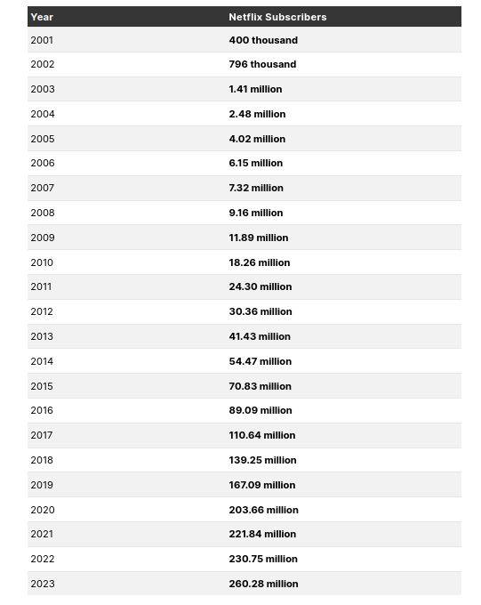

---
jupytext:
  text_representation:
    extension: .md
    format_name: myst
    format_version: 0.13
    jupytext_version: 1.17.0
kernelspec:
  display_name: Python 3 (ipykernel)
  language: python
  name: python3
---

# Sparekalkulator og Logistisk vekst

* Vi har sett på 2 caser - en sparekalkulator og modellering og simulering av populasjonsvekst
* Et utvalg av oppgavene vi jobber med skal som sagt leveres inn i mappen
* En god strategi til mappen, er å ikke levere programmer som løser oppgavene nøyaktig som beskrevet -- men  å bruke programmet ditt i et konkret tilfelle/problemstilling slik at du har mulighet til å diskutere resultatene

### FEKS:
- Du har laget et program som spør bruker om data og viser populasjonsutvikling
    - Eksemplifiser da bruken av programmet ditt i et konkret tilfelle og diskuter resultat
- Du har laget en sparekalkulator som regner ut sluttsaldo på en konto og viser utviklingen over tid med et barplott
    - Finn da et «sparecase» hvor du bruker programmet ditt til å oppnå et sparemål
    - Kanskje tenker du å spare til bil, ny mac e.l. -- vis hvordan du da kan nyttiggjøre programmet ditt
- Du har laget en sparekalkulator som gjør spareutregningene for mange kunder (kundedata)
    - Spør deg selv hva man kan bruke et slikt program til å undersøke, feks om du jobber i en bank:
    - Kanskje kan programmet utvides til å gi ytterligere statistikk om kundene (Hvor mange er «rike», hva er gjennomsnittlig sparebeløp)
    - Dersom man skal markedsføre overfor kundene for at de skal forbli kunder og maksimere pengebeholdningen, hvilken strategi bør man bruke?
    - I eksempelet over kan man se på effekten av pengebeholdning dersom man bruker mye ressurser på mange gjennomsnittlige sparere, eller mindre ressurser på å beholde de «rike» sparerene -- Bruk skjønn og fryktløs gjetning til å undersøke parametre her
- Du kan modellere noe annet enn populasjon -- Eks:
    - Befolkningsvekst og arbeidstilbud
    - Markedspenetrasjon av nye produkter
    - Diffusjon av innovasjoner
    - Økonomisk vekst i fremvoksende markeder
    - S-kurve i konjunktursykluser
    - Epidemier og økonomisk påvirkning
    - Urbanisering og infrastrukturutvikling
    - Metning av finansmarkeder
    - Forbrukeratferd og produktets livssyklus
    - Ressursutnyttelse og bærekraft
    
* Her følger noen variasjoner med økende vanskelighetsgrad
  

+++

# Populasjonsvekst 3.1.1 (Ca. hvor dere skal ha kommet i uke 35)

+++

Prøv å modellere populasjonsveksten i et område
* Finn noe data å ta utgangspunkt i, spesielt for vekstrate $r$ og startpopulasjon $P_0$
  - Eventuelt spør programmet bruker om parameterene
* Gjør så godt kvalifiserte gjetninger du kan for makspopulasjonen for området $K$ (Eller spør bruker)
* Regn ut populasjonsveksten over et tidsrom og lag et plot av utviklingen
* Programmet gir tilbake nyttig informasjon (Total vekst, absolutt vekst osv)


+++

# 3.1.2 Sammenligne vekst
* Lag et program som modellerer og simulerer befolkningsvekst for to eller flere områder
* Lag et plot av utviklingen
* Programmet skriver ut nyttig info om utvikling feks:
    - Hvilket område har vokst mest
    - er størst
    - Total vekst, absolutt og relativ for de forskjellig områdene
    

+++

# 3.1.3 Finne krysningspunkt for to populasjoner med logistisk vekst
* Lag et program som modellerer og simulerer befolkningsvekst for to områder
* Lag plot av utviklingen
* Beregn når og dersom det ene området overstiger det andre i populasjonsstørrelse
* Programmet skriver ut nyttig info slik som tidligere

+++

# 3.1.4 Diffusjon av innovasjoner
Den logistiske ligningen kan brukes til å modellere hvordan nye teknologier tas i bruk:
* Til å begynne med skjer veksten tilnærmet eksponensielt
* «Makspopulasjonen» $K$ er nå potensielle brukere av teknologien og kan bero på mange faktorer:
  - Ser vi på innføringen av el-biler kan det feks være bilenes rekkevidde, pris og utbyggingen av ladenettet
  - Ser vi på antall brukere av streaming-tjenseter kan det være tilgjengelig innhold, pris, tilgjengelighet av raskt bredbånd osv.

Figuren under viser antall Netflix-brukere etter innføringen i 2001




* Plot dataene i tabellen som prikkeplott
* Ta i bruk litt prøving og feiling for å modellere antall netflix-brukere med den logistiske modellen
* (Det finnes gode måter å gjøre dette skikkelig på som vi skal se på senere i kurset)
* Hva er maksimalt antall kunder netflix kan få i følge modellen din, og hvordan blir utviklingen?
* Dersom netflix klarer å øke kundegruppen sin med 10% i 2023 - Hvor mye antar vi at antall brukere vil øke med de neste 5 årene?

```{code-cell} ipython3
import matplotlib.pyplot as plt

tid_aar = list(range(2001,2024))
brukere = [400e3, 796e3, 1.41e6, 2.48e6, 4.02e6,6.15e6,7.32e6,9.16e6,11.89e6,
           18.26e6,24.30e6,30.36e6,41.43e6,54.47e6,70.83e6,89.09e6,110.64e6,139.25e6,
           167.09e6,203.66e6,221.84e6,230.75e6,260.28e6]
```

```{code-cell} ipython3

```

# Sparekalkulator 3.2.1 (Ca. hvor dere skal ha kommet i uke 35)

* Lag et program som regner ut saldo på sparekonto over tid
  

+++

# 3.2.2

* Lag et program som viser og plotter ulike sammenhenger mellom parametre under sparing:
    - Sluttsaldo etter x (feks x=10) år som funksjon av rente
    - Sluttsaldo etter x (feks x=10) år med fast terminbeløp $P$ (feks = $P=1000$) som funksjon av antall innskudd i året
    - Andel renter som funksjon av tid, og andel renter etter x år som funksjon av rentesats

+++

# 3.2.3
* Lag en sparekalkulator som forteller:
  - Hvor mye du må spare for å nå et sluttbeløp innen en gitt tid
  - Hvor lenge du må spare for å nå et sluttbeløp med et gitt terminbeløp
  - Hvor mye du må øke/minke terminbeløpet ditt med for å nå et sparemål dersom renten endres underveis
  

+++

# 3.2.3

* Cellen under leser inn noe kundedata
* Dataen inneholder en liste av dictionarier med følgende "felt" eller nøkler:
     - "fornavn"
     - "etternavn"
     - "startsaldo"

```{code-cell} ipython3
import json
with open("kundedata1.json", 'r') as file:
    kundedata = json.load(file)
info = f"""Listen inneholder data om {len(kundedata)} kunder.
For hver kunde har vi data om {list(kundedata[0].keys())}"""
print(info)
```

* Lag et program som går gjennom listen og regner ut hvordan saldo på sparekonto vokser over tid.
* Ta i første omgang utgangspunkt i at alle kunder sparer et fast terminbeløp $n$ ganger i året, til en fornuftig rente $r$

* Hvordan er fordelingen av sparepenger blant kundene? -- lag et histogram med pyplot (plt.hist(.....)) som viser dette
* Utifra fordelingen av sparepenger -- sett noen fornuftige grenser for foreksempel "lite bemidlet", "middels bemidlet" og "rike" kunder
* Oppdater dataene med disse klassifiseringene
* Vis fordeling med et kake-diagram og histogram

```{code-cell} ipython3
import matplotlib.pyplot as plt

def sluttsaldo_sparing(P,r,n,t):
    rn = r/n
    F = P*((1+rn)**(n*t)-1)/rn
    return F

def lag_saldofunksjon(P,r,n):
    def funksjon(t):
        return sluttsaldo_sparing(P,r,n,t)
    return funksjon

t_slutt = 10 #10 år
r = 0.05
n = 12
P = 1000
for kunde in kundedata:
    kunde["saldo"] = []
    kunde["saldofunksjon"] = lag_saldofunksjon(P,r,n)
    saldofunk = kunde["saldofunksjon"]
    for t in range(t_slutt):
        saldo_t = saldofunk(t)+kunde["startsaldo"]*(1+r)**t
        kunde["saldo"].append(saldo_t)
    #print(f"Saldo for {kunde['fornavn']} er {kunde['saldo'][-1]}")

sluttsaldo_liste  = []
for kunde in kundedata:
    sluttsaldo_liste.append(kunde["saldo"][-1])
plt.hist(sluttsaldo_liste)

rik = 200e3
middels = 160e3

segmenter = {"rik": 0, "middels": 0, "lav": 0}
for kunde in kundedata:
    saldo = kunde["saldo"][-1]
    if saldo > rik:
        kunde["segment"] = "rik"
        segmenter["rik"] += 1
    elif saldo > middels:
        kunde["segment"] = "middels"
        segmenter["middels"] += 1
    else:
        kunde["segment"] = "lav"
        segmenter["lav"] += 1

labels = segmenter.keys()
plt.pie(segmenter.values(), labels=labels)
plt.show()

parametre= {"P": {"rik": 5000, "middels": 1000, "lav": 500},
           "r": {"rik": 0.06, "middels": 0.04, "lav": 0.025}
          }

for kunde in kundedata:
    segment = kunde["segment"]
    kunde["saldofunksjon"] = lag_saldofunksjon(parametre["P"][segment], parametre["r"][segment], n)
    saldofunk = kunde["saldofunksjon"]
    kunde["saldo"] = []
    for t in range(t_slutt):
        saldo_t = saldofunk(t)+kunde["startsaldo"]*parametre["r"][segment]*t
        kunde["saldo"].append(saldo_t)

sluttsaldo_liste2 = []
for kunde in kundedata:
    sluttsaldo = kunde["saldo"][-1]
    sluttsaldo_liste2.append(sluttsaldo)

plt.hist(sluttsaldo_liste2, bins=20)
plt.show()
plt.plot(sluttsaldo_liste2, '.', markersize=1)
plt.show()
```

```{code-cell} ipython3
import numpy as np
t_slutt = 150
P_default = 1000
bias = 0.2
def trekk_parameter_fair():
    P = np.random.normal(loc=P_default, scale=100)
    r = np.random.normal(loc=0.05, scale=0.005)
    return P_default, 0.05

def trekk_parameter_unfair(segment):
    if segment == "rik":
        P = np.random.normal(loc=P_default*(1+bias), scale=100)
        r = np.random.normal(loc=0.05*(1+bias), scale=0.005)
    elif segment == "middels":
        P = np.random.normal(loc=P_default, scale=100)
        r = np.random.normal(loc=0.05, scale=0.005)
    else:
        P = np.random.normal(loc=P_default*(1-bias), scale=100)
        r = np.random.normal(loc=0.05*(1-bias), scale=0.005)
    return P, r


for kunde in kundedata:
    segment = kunde["segment"]
    P_fair, r_fair = trekk_parameter_fair()
    P_unfair, r_unfair = trekk_parameter_unfair(segment)
    parametre = {"fair": {"P": P_fair, "r": r_fair},
                 "unfair": {"P": P_unfair, "r": r_unfair}
                }
    kunde["parametre"] = parametre
    kunde["saldofunksjon"] = lag_saldofunksjon(P_fair, r_fair, n)
    kunde["saldofunksjon_unfair"] = lag_saldofunksjon(P_unfair, r_unfair, n)
    saldofunk = kunde["saldofunksjon"]
    saldofunk_unfair = kunde["saldofunksjon_unfair"]
    kunde["saldo"] = []
    kunde["saldo_unfair"] = []
    
    for t in range(t_slutt):
        saldo_t = saldofunk(t)+kunde["startsaldo"]*kunde["parametre"]["fair"]["r"]*t
        saldo_unfair_t = saldofunk_unfair(t)+kunde["startsaldo"]*kunde["parametre"]["unfair"]["r"]*t
        kunde["saldo"].append(saldo_t)
        kunde["saldo_unfair"].append(saldo_unfair_t)
    

sluttsaldo_liste_fair = []
sluttsaldo_liste_unfair = []
for kunde in kundedata:
    sluttsaldo = kunde["saldo"][-1]
    sluttsaldo_unfair = kunde["saldo_unfair"][-1]

    sluttsaldo_liste_fair.append(sluttsaldo)
    sluttsaldo_liste_unfair.append(sluttsaldo_unfair)

plt.hist(sluttsaldo_liste_fair, alpha=0.5, label="Rettferdig", bins=20, density=True)
plt.hist(sluttsaldo_liste_unfair, alpha=0.5, label="Urettferdig", bins=20, density=True)
plt.legend()
plt.show()
#plt.plot(sluttsaldo_liste2, '.', markersize=1)
#plt.show()

x = np.linspace(0,1,20,endpoint=True)
```

```{code-cell} ipython3
x = np.linspace(0,1,21,endpoint=True)
#Vi sorterer saldolisten
sluttsaldo_liste_fair.sort()
sluttsaldo_liste_unfair.sort()
n_kunder = len(sluttsaldo_liste_fair)
total_pengebeholdning = sum(sluttsaldo_liste_fair)
total_pengebeholdning_unfair = sum(sluttsaldo_liste_unfair)
fordeling = []
fordeling_unfair = []
for xs in x:
    if xs==0.:
        fordeling.append(0.0)
        fordeling_unfair.append(0.0)
        continue #Begynner på nytt i løkken
    
    sluttindeks_percentil = int(xs*n_kunder)
    kunder_percentil = sluttsaldo_liste_fair[0:sluttindeks_percentil]
    kunder_percentil_unfair = sluttsaldo_liste_unfair[0:sluttindeks_percentil]
    total_pengeandel = sum(kunder_percentil)
    total_pengeandel_unfair = sum(kunder_percentil_unfair)

    fordeling_unfair.append(total_pengeandel_unfair/total_pengebeholdning_unfair)
    fordeling.append(total_pengeandel/total_pengebeholdning)
plt.plot(x,fordeling, label="Faktisk")
plt.plot(x,fordeling_unfair, label="Faktisk, unfair")
plt.plot([0,1], [0,1],label="ideell")
plt.legend()
plt.show()
```

# 3.2.4

### Vi bygger videre på programmet i 3.2.3

* Les deg opp om [Gini-koeffisienten](https://en.wikipedia.org/wiki/Gini_coefficient) og [Lorenz-kurven](https://en.wikipedia.org/wiki/Lorenz_curve)
* Ta utgangpunktpunkt i "kundedata" fra forrige oppgave
* Hva skjer med fordelingen av sparepenger når det har gått lang tid?
* Vi klarer kanskje ikke helt å regne ut Gini-koeffisienten, men vi kan plotte Lorenzkurven
* Startsaldo i dataene er normalfordelt rundt 100,000 med standardavvik 20,000
* Undersøk hva som skjer med Lorenzkurven og pengefordelingen dersom vi vi gir ulike kundegrupper ulike sparevilkår
* Du kan bruke `np.random.normal(loc=«normalverdi», scale=«standardavvik»)` til å trekke et tilfeldig tall fra en normalfordeling sentrert rundt «normalverdi» med standardavvik «standardavvik»
  
  

+++

# 3.2.4

### Vi bygger videre på programmet i 3.2.3:

Anta at vi banken vil føre en markedsføringskampanje for både å holde på kundene, og skaffe nye kunder.
* Vi kan markedsføre oss overfor de rike, middels bemidlede eller lite bemidlede sparegruppene
* Vi ønsker å undersøke utfallet av forskjellige strategier eller scenario

1. Det koster like mye å markedsføre seg til alle segmentene -- uavhengig av hvor mange kunder det er i segmentet. Vi øker kundebestanden vår med en viss prosent (prøv forskjellige verdier, feks 10%, 20%, ...) der hvor vi markedsfører oss mot, og mister tilsvarende prosentandel der hvor vi ikke markedsfører oss
2. 


+++

# 3.2.3 (Oppgave med kundedata kommer)

```{code-cell} ipython3
import pandas as pd
import numpy as np
import matplotlib.pyplot as plt
import json
import random

df = pd.read_csv("kundeliste.csv", index_col=0)
kundeliste = [ {"fornavn": fornavn, "etternavn": etternavn } 
                for fornavn, etternavn in zip(list(df["fornavn"]),list(df["etternavn"]))
             ]

fornavn_liste = list({kunde["fornavn"] for kunde in kundeliste})
etternavn_liste = list({kunde["etternavn"] for kunde in kundeliste})

kundeliste2 = [ {"fornavn": random.choice(fornavn_liste), "etternavn": random.choice(etternavn_liste)} for i in range(2000)]

#Lettest
#for kunde in kundeliste2:
#    kunde.update({"startsaldo": round(np.random.normal(loc=100e3, scale=30e3), 2)})
#
#with open("kundedata1.json", 'w') as file:
#    json.dump(kundeliste2,file)


segmenter = [0.1,0.2,0.3,0.4,0.5,0.6,0.7,0.8,0.9,1.0]
gini_kurve = lambda x: x**3

total_wealth = len(kundeliste2)*100e3
n = len(kundeliste2)

for segment in segmenter:
    andel=gini_kurve(segment)
    formue_segment = andel*total_wealth
    segment_liste = kundeliste2[int((segment-0.1)*n):int(segment*n)]
    snitt_segment = formue_segment/len(segment_liste)
    spredning = snitt_segment*0.20
    for kunde in segment_liste:
        kunde["saldo"] = np.random.normal(loc=snitt_segment, scale=spredning)
        
    

for kunde in kundeliste2:
    kunde.update({"startsaldo": round(np.random.normal(loc=100e3, scale=30e3), 2)})


#plt.hist([kunde["saldo"] for kunde in kundeliste])

with open("kundedata.json", 'w') as file:
    json.dump(kundeliste2, file)

#plt.show()
plt.hist([kunde["saldo"] for kunde in kundeliste2])
plt.show()
```

```{code-cell} ipython3
kundeliste_sjekk = None
with open("kundedata.json", 'r') as file:
    kundeliste = json.load(file)
#kundeliste
```

```{code-cell} ipython3
saldo_liste = []
for kunde in kundeliste:
    saldo_liste.append(kunde["saldo"])

plt.hist(saldo_liste)
plt.show()
samlet_formue = sum(saldo_liste)
print("Samlet", samlet_formue)
saldo_liste.sort()
gini_liste = [0.1,0.2,0.3,0.4,0.5,0.6,0.7,0.8,0.9,1.0]
gini_liste = [ i/100 for i in range(0,100,3)]
n_kunder = len(saldo_liste)
gini_opptelling = []
for gr in gini_liste:
    i_ovre = int(gr*n_kunder)
    samlet = saldo_liste[:i_ovre]
    andel_formue = sum(samlet)/samlet_formue
    gini_opptelling.append(round(andel_formue,2))
print("Fordeling", gini_opptelling)
gini_liste.insert(0,0)
gini_opptelling.insert(0,0)
plt.plot(gini_liste, gini_opptelling)
plt.plot([0,1],[0,1])
plt.show()

print(gini_liste)
```

# Plan for oppgaver:

## Lettest
1. Kundeliste -- oppdater vekst
2. se på fordeling (før og etter)
3. klassifiser "rike", "gjennomsnittlig", "fattig"
4. Fremstil plot

## Middels
1. Maksimere total saldo
2. Pris markedsføring rik vs. fattig
3. Ingen randomness -- mister en viss % får en viss %

## Vanskelig
1. Regn ut gini-kurve normalfordelt gitt
2. Lag en skjevfordeling selv
3. Regn ut gini koeffisient
4. Simulere utvikling
5. Grep for å øke eller minke GINI
6. Samtidig maksimere pengebeholdning
