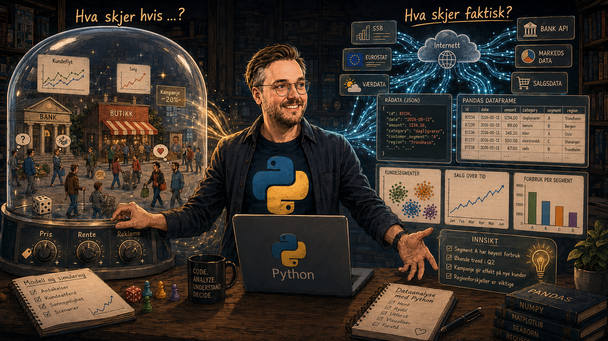

## I dag

1. Hvem er jeg – og hvorfor programmering?
2. Hva skal vi lære, og hvordan skal vi arbeide?
3. Vurdering, arbeidskrav og timeplan
4. En rask rundtur i verktøyene våre
5. Kickstart: Hvor langt kommer vi med KI?

::: {.notes}
Dette er en orienteringsøkt, ikke en detaljert gjennomgang av hele emnet.
Målet er at alle vet hvor de skal møte, hvor de finner stoffet og hva de skal
gjøre først.
:::

## Hvem er jeg?

:::: {.columns}
::: {.column width="58%"}
### Jonas Julius Harang

- Universitetslektor ved NTNU
- Sivilingeniør i teknisk fysikk
- Masteroppgave i beregningsfysikk
- Bachelor i datavitenskap
- Kontor **B227**

:::

::: {.column width="42%"}
> Ble bitt av programmeringsbasillen når jeg fant ut hva jeg kunne bruke det til
:::
::::

## Hvordan oppdaget jeg programmering?

:::: {.columns}
::: {.column width="48%"}
- «Tavlefysikk» var praktisk begrenset
- Programmering ga meg en ny regnekraft
- Master i beregningsfysikk med Fortran 90
- Tok datafag under PPU
- Det var så gøy at det ble en bachelor i datavitenskap

### En superkraft for å undersøke modeller
:::

::: {.column width="52%"}
{fig-alt="Illustrasjon av programmering som en superkraft i fysikk" width="100%"}
:::
::::

## Den samme superkraften i økonomiske fag

:::: {.columns}
::: {.column width="48%"}
Med programmering kan vi:

- gjøre beregninger som ellers blir uhåndterlige
- undersøke mange scenarioer raskt
- finne struktur i store og rotete datasett
- hente ferske data direkte fra kilder
- gjøre analysene dokumenterbare og gjentakbare
:::

::: {.column width="52%"}
{fig-alt="Illustrasjon av programmering brukt på økonomiske data" width="100%"}
:::
::::

## Hva skal vi arbeide med?

:::: {.columns}
::: {.column width="50%"}
### Del I · Simulering
:::

::: {.column width="50%"}
### Del II · Dataanalyse
:::
::::

{fig-alt="Illustrasjon av simulering og dataanalyse som kursets to hoveddeler" width="82%"}

## Hvorfor lære programmering når KI kan skrive kode?

KI kan lage kode raskt. Den kan også lage kode som:

- svarer på feil spørsmål
- bruker dataene feil
- skjuler svake antakelser
- gir overbevisende, men meningsløse resultater

> Målet er ikke å huske mest mulig syntaks. Målet er å kunne bruke Python og KI
> **selvstendig, kritisk og faglig**.

## Det viktigste læringsmålet

Når emnet er ferdig, skal du kunne bruke Python i **din egen faglige kontekst**.

Det betyr å kunne:

1. formulere et spørsmål som faktisk kan undersøkes
2. finne eller lage relevante data
3. bygge og kontrollere en analyse eller simulering
4. tolke resultatene med faglig skjønn
5. forklare hva du gjorde, og hvor grensene går

## Fast timeplan · uke 34–47

:::: {.columns}
::: {.column width="50%"}
### Tirsdag

**12.15–14.00 · Brosundet** 
Forelesning og demonstrasjon

**14.00–16.00 · Storhavet** 
Veiledning og øving
:::

::: {.column width="50%"}
### Torsdag

**08.15–12.00 · Fyrtårnet**

Samlet læringsøkt med forelesning, demonstrasjon, selvstendig arbeid,
gruppearbeid og veiledning.

Her legger vi også workshopene.
:::
::::

## Vurdering · én mappe, tre deler

::::: {.columns}
:::: {.column width="33%"}
::: {.assessment-card}
1

### Simuleringsessay

Kode og faglig tekst i Jupyter Notebook.
:::
::::

:::: {.column width="33%"}
::: {.assessment-card}
2

### Dataanalyseessay

Egen problemstilling, data, analyse og tolkning.
:::
::::

:::: {.column width="33%"}
::: {.assessment-card}
3

### Refleksjonsnotat

Hva har du lært – også om bruk av KI?
:::
::::
:::::

::: {.assessment-meta}
**Individuelt** · **Bokstavkarakter** · **Levering i desember**
:::

## Obligatoriske aktiviteter

### To arbeidsverksteder

1. **Simuleringsverksted** etter den felles simuleringsdelen
2. **Dataanalyseverksted** mot slutten av undervisningsperioden

Du møter med en skisse, en foreløpig problemstilling og noe du har prøvd.
Poenget er å få respons **før** sluttinnleveringen.

Det kommer også noen korte, selvrettende programmeringsøvinger. Mer informasjon
om disse og eventuelle andre arbeidskrav kommer senere.

## Praktisk informasjon {.info-divider data-background-color="#00509e"}

### Tre adresser du bør lagre nå

Jupyter Book · Canvas · iirmoodle

## Jupyter Book · Canvas · iirmoodle

::::: {.columns}
:::: {.column width="33%"}
::: {.system-card}

Jupyter Book

Kursstoff, ukeplan, installasjon, slides og oppgaver.

[iirevu.org.ntnu.no/iira2001v2/](../)
:::
::::

:::: {.column width="33%"}
::: {.system-card}

Canvas

Emnerom, beskjeder og praktisk informasjon.

[canvas.ntnu.no](https://www.canvas.ntnu.no)
:::
::::

:::: {.column width="33%"}
::: {.system-card}

iirmoodle

Selvrettende oppgaver, aktiviteter og innleveringer.

[iirmoodle.it.ntnu.no](https://iirmoodle.it.ntnu.no)

**Meld deg på IIRA2001 (H26).**
:::
::::
:::::

::: {.notes}
Vis alle tre tjenestene. I boka: forsiden og uke 34. I Canvas: emnerommet og
beskjeder. I Moodle: logg inn, finn «IIRA2001 Programmering og data i
økonomiske fag (H26)», meld på og kontroller tilgang.
:::

## Menti · hvilke KI-tjenester bruker dere?

<iframe
  sandbox="allow-popups allow-scripts allow-same-origin allow-presentation"
  data-external="1"
  allowfullscreen="true"
  allowtransparency="true"
  frameborder="0"
  src="https://www.mentimeter.com/app/presentation/alft3rnytawnxf4zne6ptnmt1obbiiw6/embed"
  title="Mentimeter: Hvilke KI-tjenester bruker dere?">
</iframe>

Hvis innbyggingen ikke åpnes:
[Åpne Mentimeter i en ny fane](https://www.mentimeter.com/app/presentation/alft3rnytawnxf4zne6ptnmt1obbiiw6/embed).

::: {.notes}
La studentene svare, og bruk resultatet som utgangspunkt for en kort samtale
om hvilke KI-verktøy de allerede kjenner og hva de bruker dem til.
:::

## GPT NTNU · vår anbefalte KI-tjeneste

Åpne [gpt.ntnu.no](https://gpt.ntnu.no)

- Logg inn med Feide
- Vær koblet til **eduroam**, eller bruk **VPN**
- Velg mellom flere åpne språkmodeller
- Sammenlign gjerne hvordan modellene svarer

**Ikke legg personopplysninger, passord eller fortrolige data inn i en
KI-tjeneste.**

::: {.notes}
Vis innlogging, modellvelgeren, en ny samtale og hvordan man følger opp et svar.
Poengter at modellnavn og tilgjengelige modeller kan endre seg.
:::

## Kickstart {.image-only}

{.r-stretch fig-alt="Studentene møter en krevende analyseoppgave og utforsker hvor langt de kommer med KI som samarbeidspartner."}

## Kickstart · hvor langt kommer du med KI?

:::: {.columns}
::: {.column width="54%"}
Dere får et datasett om kredittkortkunder og en oppgave som egentlig er for
vanskelig akkurat nå.

Bruk KI til å:

1. forstå datasettet
2. finne et interessant forretningsspørsmål
3. lage og kjøre en analyse
4. forsøke å tolke resultatene
5. dokumentere hva dere forstår – og ikke forstår
:::

::: {.column width="46%"}
::: {.kickstart-small-image}
{fig-alt="Student som bruker KI til å analysere bankdata."}
:::
:::
::::

[Åpne kickstartoppgaven](../kickoff-banksegmentering)

## Dette er et eksperiment

Du blir ikke målt på hvor avansert kode KI-en lager.

Ta vare på:

- noen av promptene dine
- koden du prøver
- resultater og figurer
- feilmeldinger og blindveier
- minst én ting du **ikke forstår**

Mot slutten av kurset skal du møte dette arbeidet igjen.

## Før vi går videre

- [ ] Jeg finner emnet i Canvas
- [ ] Jeg har meldt meg inn i iirmoodle
- [ ] Jeg finner kursboken og uke 34
- [ ] Jeg kommer inn på GPT NTNU
- [ ] Jeg vet hvor og når vi møtes
- [ ] Jeg er klar til å prøve – også uten å forstå alt

## Spørsmål?

### Neste steg: installasjon og kickstartoppgaven

> Målet i dag er ikke å kunne programmere. Målet er å komme i gang.
